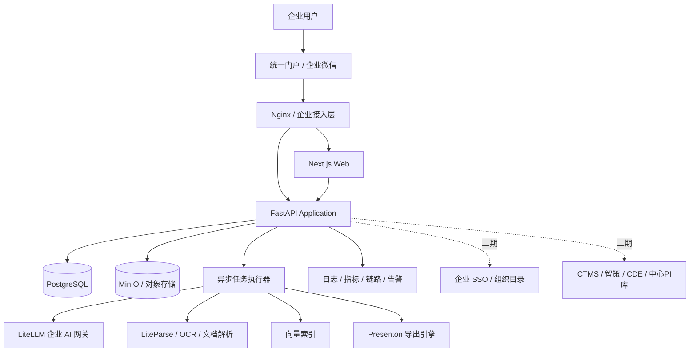
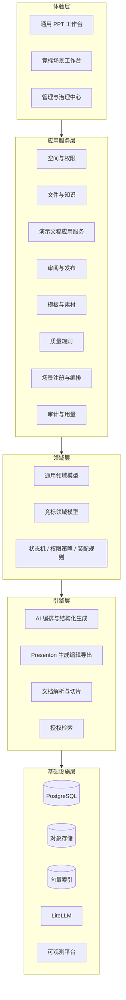
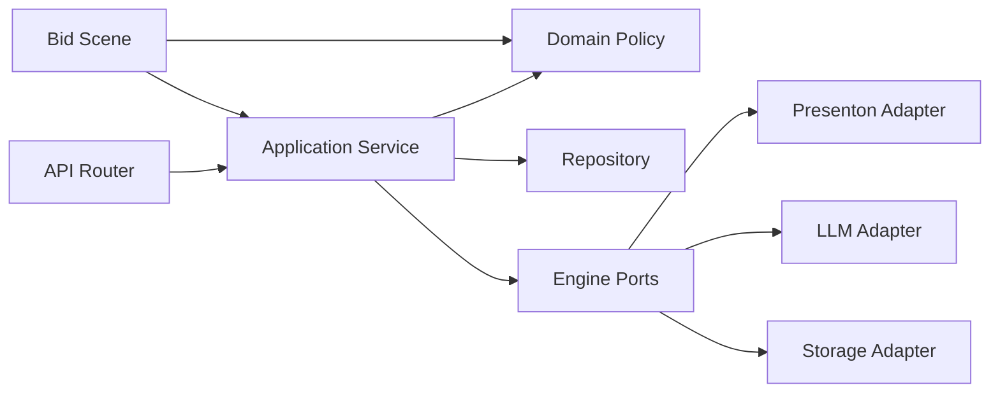
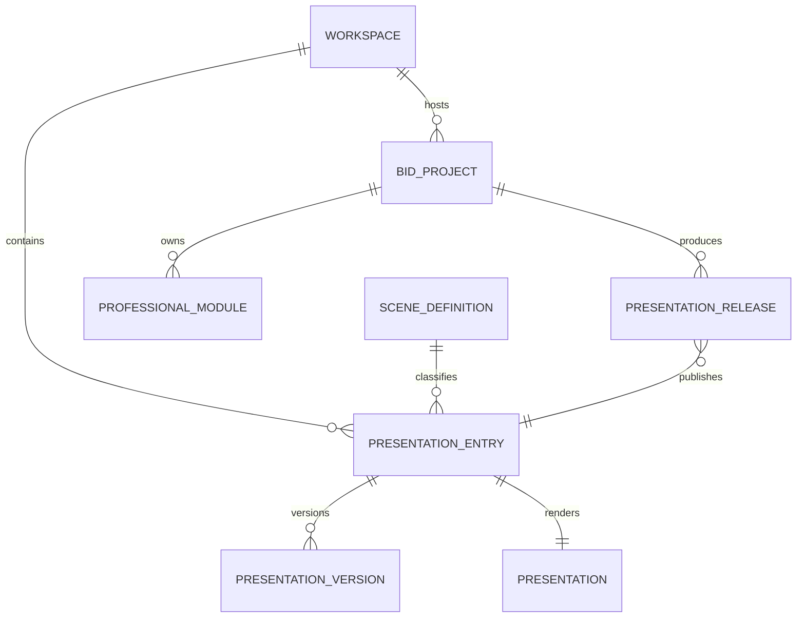
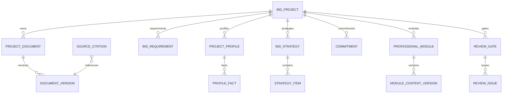
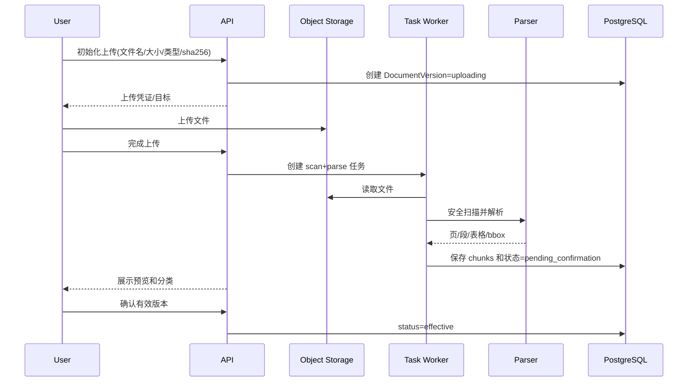
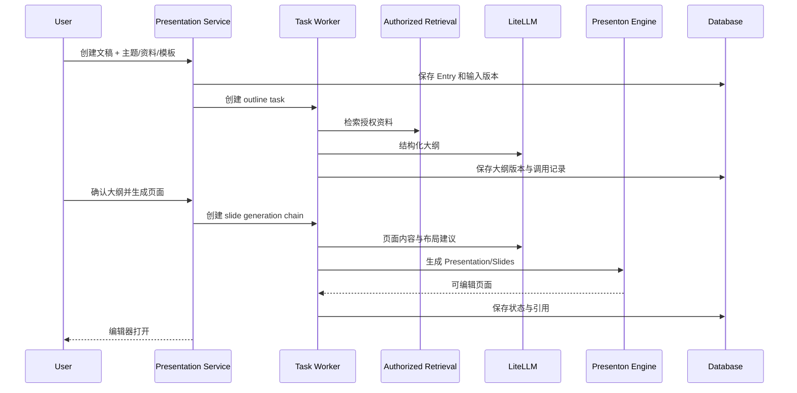
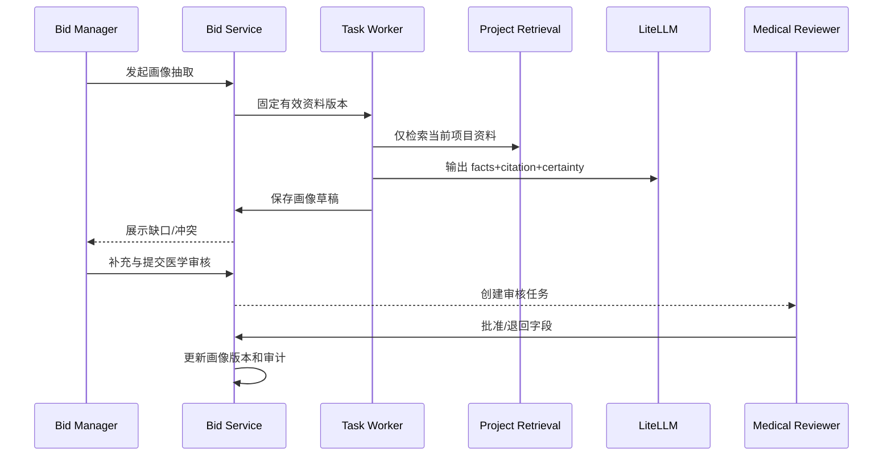
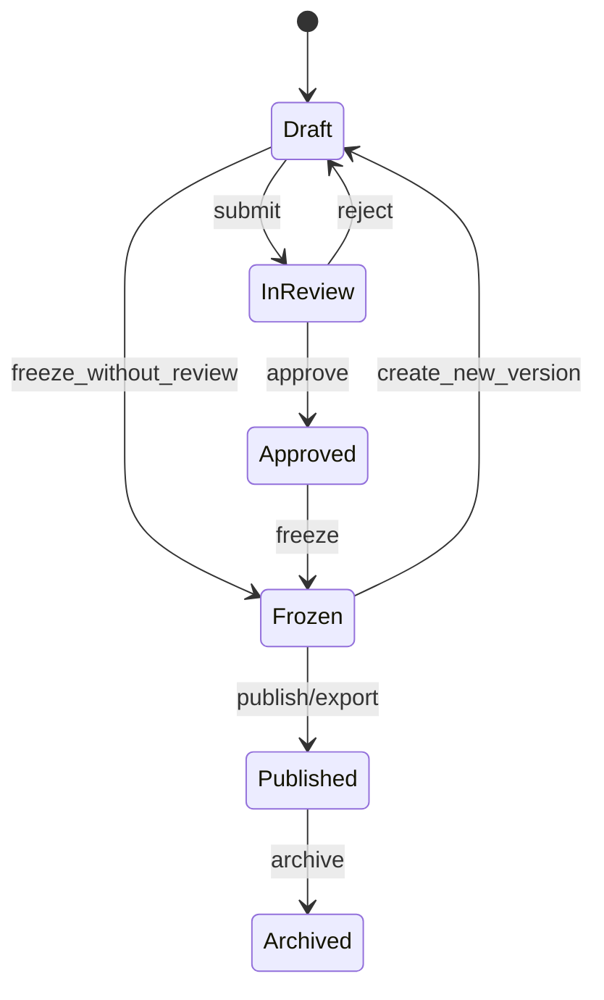
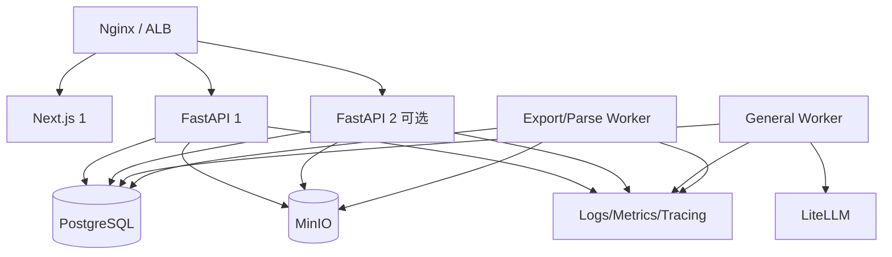

# 企业 PPT 制作中台｜详细技术架构设计

> 基于 `企业PPT制作中台二开开发落地方案.md` 展开<br>
> 架构范围：企业公共中台、通用 PPT 工作台、专业场景扩展、Presenton PPT 引擎<br>
> 首个专业场景：竞标方案工作台<br>
> 文档版本：V1.0<br>
> 编制日期：2026-08-12

---

## 1. 文档目标

本文用于指导架构评审、数据库设计、接口设计、任务拆分、部署实施和测试验收，重点回答：

1. 如何在当前 Presenton 仓库上增量建设企业 PPT 中台；
2. 如何保证通用 PPT 工作台不被竞标业务绑死；
3. 如何以场景扩展机制接入竞标及后续专业工作台；
4. 如何实现空间权限、文件版本、知识引用、AI 编排、审核发布和全链路审计；
5. 如何降低对现有生成、编辑、模板和导出内核的侵入，持续合并上游版本；
6. 如何从单机 POC 平滑演进到企业试点和生产架构。

本文是详细技术设计基线，不替代具体表结构迁移脚本、OpenAPI 文件、Prompt/schema 文件和运维手册。进入开发前，各模块仍需补充对应的 LLD。

---

## 2. 架构目标、约束与非目标

### 2.1 架构目标

- 全员可以通过轻流程创建、生成、编辑、审阅和导出日常 PPT；
- 专业场景通过插件化业务域复用通用平台，而非复制产品；
- 任意资源访问都有空间或项目权限依据；
- 从资料生成的事实、数字和专业结论可以定位到来源版本；
- AI 调用只经过企业 LiteLLM 网关，可按密级和任务路由；
- 正式发布版本不可漂移，可追踪生成输入、内容版本、模型与文件哈希；
- PPTX 保持主要元素可编辑，并通过 PowerPoint/WPS 回归；
- 初期保持模块化单体，后续能按任务执行、知识检索等边界拆分；
- 尽量通过外围扩展关联现有表，减少 Presenton 上游合并冲突。

### 2.2 已知约束

| 约束 | 架构影响 |
| --- | --- |
| 当前仓库是 Next.js + FastAPI | 继续使用现有技术栈，不引入第二套应用框架 |
| 当前 presentation/slide/template 已承载生成编辑 | 新领域通过关联表扩展，不破坏核心 JSON 结构 |
| 当前 owner_id 适合个人隔离 | 新增 workspace membership 和 project role，不复用为团队账号 |
| 企业模型统一走 LiteLLM | 应用只使用能力别名，不保存用户外部 Key |
| 中文和 Office/WPS 兼容要求高 | 导出回归和字体治理属于核心架构能力 |
| 竞标资料可能达到 L3/L4 | 检索前鉴权、项目隔离和模型路由必须服务端执行 |
| 一期团队有限 | 模块化单体优先，避免过早微服务化 |

### 2.3 非目标

- 一期不建设实时多人同屏编辑；
- 一期不建设完整企业文档管理系统；
- 一期不自研通用工作流引擎，使用有限策略 + 场景状态机；
- 一期不建设大型知识图谱；
- 一期不自动批准专业判断和服务承诺；
- 一期不生成完整 120—150 页竞标技术标书；
- 不把页面整体栅格化作为常规 PPTX 输出方案；
- 不允许场景包直接修改通用 Presentation 核心状态。

---

## 3. 架构原则

1. **平台能力通用化**：身份、空间、文件、模板、素材、任务、版本、质量和审计均不包含竞标专属字段。
2. **场景能力插件化**：场景通过 `scene_type + scene_definition` 注册 schema、任务、流程、角色和规则。
3. **业务对象与渲染对象分离**：项目画像、需求矩阵、策略项是业务事实；Presentation/Slide 是交付视图。
4. **来源优先**：先保留来源和数据状态，再生成表达；不能以生成后的页面反推正式事实。
5. **确定性规则优先**：权限、状态、数字、字体、越界和门禁由代码判断，模型只补充语义能力。
6. **默认安全**：外联、搜索、图库和图片生成默认关闭，权限过滤发生在检索和读取之前。
7. **不可变发布**：冻结版本保存 manifest、内容快照和文件哈希，后续修改创建新版本。
8. **异步长任务**：解析、抽取、生成、质量检查和导出均以任务执行，HTTP 请求只负责创建和查询。
9. **契约驱动 AI**：所有 AI 任务使用版本化输入/输出 schema，禁止长文本作为唯一业务结果。
10. **渐进演进**：先完成模块化单体和数据库任务队列，容量证据出现后再拆服务。

---

## 4. 系统上下文架构



### 4.1 信任边界

| 边界 | 控制 |
| --- | --- |
| 用户到接入层 | HTTPS、企业身份、登录限流、会话安全 |
| Web 到 API | SameSite/HttpOnly Cookie、CSRF 策略、同源代理 |
| API 到数据层 | 最小权限账号、私网、TLS、连接池、审计 |
| API/任务到 LiteLLM | 系统凭证、模型别名、请求密级、超时和配额 |
| 对象存储访问 | 私有桶、服务端鉴权、短时签名 URL |
| 知识检索 | 查询前注入空间/项目 ACL，不允许结果后过滤 |
| 外部业务系统 | 服务账号、字段白名单、同步水位和失败补偿 |

---

## 5. 逻辑分层架构



### 5.1 各层职责

| 层 | 可以做 | 不可以做 |
| --- | --- | --- |
| 体验层 | 收集输入、展示状态、发起命令 | 自行决定权限和状态流转 |
| 应用服务层 | 事务编排、权限、幂等、调用领域规则 | 直接拼接未验证 AI 文本为正式业务结果 |
| 领域层 | 状态机、不变量、规则和场景策略 | 依赖 HTTP、React 或具体数据库会话 |
| 引擎层 | 解析、检索、AI 生成、PPT 渲染导出 | 决定专业批准和发布权限 |
| 基础设施层 | 持久化、对象、模型、监控 | 承载业务状态语义 |

---

## 6. 当前代码与目标组件映射

| 目标组件 | 当前可复用代码 | 新增内容 |
| --- | --- | --- |
| 登录和用户 | `api/v1/auth`、`api/v1/admin` | 组织、空间成员、SSO adapter |
| 通用 PPT 引擎 | `api/v1/ppt`、`utils/llm_calls` | enterprise facade、场景上下文 |
| 演示文稿存储 | `PresentationModel`、`SlideModel` | entry、version、snapshot、release |
| 模板引擎 | `TemplateV2`、template endpoints | 发布元数据、范围、版本、品牌规则 |
| 文档解析 | `DocumentsLoader`、LiteParse、Office service | 文件逻辑版本、引用定位、ACL 索引 |
| 对话改单页 | `services/chat` | 状态/权限约束、修改审计、版本触发 |
| 异步任务 | `AsyncTaskModel`、async task API | 幂等、项目/空间、重试、任务链 |
| 用户隔离 | `owner_id` scope | workspace ACL、project role policy |
| 导出 | Next.js export API、FastAPI export utils | 质量门、冻结 manifest、下载审计 |
| 模型配置 | Provider settings、LiteLLM env | 能力别名、密级、成本记录、配额 |

现有接口继续服务原有页面，新企业接口作为 facade 调用底层能力。待通用工作台稳定后，再决定是否逐步合并重复接口，不在一期做大规模路由重写。

---

## 7. 前端架构

### 7.1 路由分区

```text
servers/nextjs/app/
├── (presentation-generator)/       # 保留现有生成与编辑核心
├── (enterprise)/
│   ├── workspace/                  # 首页、空间、文件夹
│   ├── presentations/              # 新建、审阅、版本、质量、发布
│   ├── assets/                     # 模板、素材、组件
│   ├── tasks/                      # 我的任务
│   ├── admin/                      # 组织、策略、审计和模型治理
│   └── bid/                        # 竞标场景包
└── api/                            # 同源代理与导出适配
```

### 7.2 前端模块边界

- `platform-shell`：导航、身份、空间切换、全局搜索和通知；
- `workspace-client`：空间、文件夹、成员和演示文稿列表；
- `presentation-flow`：四种创建入口、大纲、设计和生成任务；
- `review-client`：评论、待办、审批、版本和发布；
- `asset-center`：模板、布局、素材与组件；
- `quality-center`：规则结果、定位、修复建议和阻断；
- `scene-runtime`：根据 `scene_definition` 加载场景导航、表单和动作；
- `bid-ui`：竞标驾驶舱、画像、矩阵、策略和专业模块。

### 7.3 状态管理原则

- 服务端业务状态以 API 为准，Redux 只保存界面和生成过程状态；
- 长任务使用统一 `task_id` 订阅/轮询，不在页面维护私有任务协议；
- 编辑器的高频本地状态继续使用现有 store；
- 审核、冻结和发布操作成功后使相关 query cache 失效；
- 对会导致内容丢失的路由切换提供未保存提示；
- 禁止前端通过修改状态字段模拟审批完成。

### 7.4 场景 UI 扩展契约

前端从 `/api/v1/enterprise/scenes` 获取可用场景定义，至少包含：

```json
{
  "scene_type": "bid",
  "version": "1.0",
  "display_name": "竞标方案工作台",
  "create_schema": "bid-project-v1",
  "navigation": ["dashboard", "documents", "profile", "requirements", "strategy", "modules", "reviews", "releases"],
  "permissions": ["bid.project.create", "bid.strategy.confirm"],
  "quality_policy": "bid-gates-v1"
}
```

一期可以由代码注册场景 UI，不要求远程动态加载 React 代码；配置用于显隐、路由、表单和策略选择。这样既保留类型安全，也为后续场景扩展建立稳定契约。

---

## 8. 后端模块化单体设计

### 8.1 建议目录

```text
servers/fastapi/
├── api/v1/enterprise/
│   ├── workspaces/
│   ├── presentations/
│   ├── documents/
│   ├── reviews/
│   ├── releases/
│   ├── templates/
│   ├── assets/
│   ├── quality/
│   ├── audit/
│   ├── scenes/
│   └── bid/
├── domains/
│   ├── platform/
│   └── scenes/bid/
├── services/enterprise/
├── models/sql/enterprise/
├── prompts/
│   ├── common/
│   └── bid/
└── schemas/
    ├── common/
    └── bid/
```

### 8.2 模块依赖规则



- API 不直接访问 SQLModel；
- 场景模块可以依赖平台应用接口，平台不能依赖竞标模块；
- repository 负责数据访问和 owner/workspace/project 过滤；
- adapter 隔离 Presenton、LiteLLM、MinIO 和向量库具体实现；
- 跨模块变更通过应用服务，不直接修改对方表；
- 审计事件与领域事务同事务写入 outbox/审计表，避免成功操作无日志。

### 8.3 核心应用服务

| 服务 | 职责 | 关键不变量 |
| --- | --- | --- |
| WorkspaceService | 空间、成员、文件夹和 ACL | 资源必须属于一个空间 |
| PresentationAppService | 创建、复制、场景关联和生成 | 场景上下文与文稿归属一致 |
| DocumentService | 逻辑文件、版本、解析和引用 | 只有确认版本可用于正式生成 |
| ReviewWorkflowService | 发起、分派、批准、退回 | 审批人具备对应动作权限 |
| ReleaseService | 冻结、快照、导出和发布 | 已冻结版本不可覆盖 |
| TemplatePublicationService | 模板范围、版本和发布 | 已发布版本内容不可原地修改 |
| AssetLibraryService | 素材、组件、授权和复用 | 跨空间复用必须满足 scope |
| QualityService | 执行规则、聚合结果和门禁 | 阻断项未清零不能发布 |
| SceneRegistryService | 场景注册、版本和策略加载 | scene_type/version 可追溯 |
| BidProjectService | 竞标项目生命周期 | 项目状态只经状态机改变 |
| BidAssemblyService | 已批准专业内容组装 | 未批准内容不能进入正式 manifest |

---

## 9. 场景扩展架构

### 9.1 场景定义模型

每个场景版本定义：

| 配置块 | 示例 |
| --- | --- |
| identity | `scene_type=bid`, version, display_name |
| create_schema | 新建项目/文稿需要的字段 |
| document_policy | 必传文件、允许类型、冲突优先级 |
| domain_objects | profile、requirements、strategy 等 |
| ai_tasks | 任务 code、输入 schema、输出 schema、模型别名 |
| assembly_policy | 模块、页数、模板和内容到页面映射 |
| workflow_policy | 状态、动作、角色和门禁 |
| quality_policy | 规则集、严重度和发布阻断条件 |
| ui_manifest | 导航、页面和动作 |
| analytics | 场景专属指标 |

### 9.2 扩展点接口

```python
class SceneExtension(Protocol):
    scene_type: str
    version: str

    def validate_create_input(self, payload: dict) -> None: ...
    def required_documents(self, context: dict) -> list[str]: ...
    def available_actions(self, state: str, roles: set[str]) -> list[str]: ...
    def build_ai_task(self, task_code: str, context: dict) -> dict: ...
    def build_assembly_manifest(self, resource_id: str) -> dict: ...
    def quality_rules(self, release_type: str) -> list[str]: ...
```

这是设计示意，实际实现应使用现有 Pydantic 类型和依赖注入方式。场景版本必须随发布快照保存，防止规则升级后无法解释历史版本。

### 9.3 通用与竞标数据关系



竞标项目可以生成多个 Presentation Entry；一个 Entry 只对应一个场景上下文。普通文稿无需创建 BidProject。

---

## 10. 数据架构

### 10.1 数据分区

| 分区 | 数据 | 存储建议 |
| --- | --- | --- |
| 身份与授权 | 用户、部门、空间、成员、角色 | PostgreSQL |
| 业务元数据 | 文稿、版本、项目、画像、审核 | PostgreSQL/JSONB |
| 大文本与二进制 | 原始文件、预览图、PPTX/PDF | MinIO/对象存储 |
| 解析文本 | chunk、页码、bbox、hash | PostgreSQL，规模上升后独立检索库 |
| 向量 | embedding 和索引 | 可替换向量库，保存外部引用 ID |
| 审计和模型调用 | audit、llm call、quality run | PostgreSQL，后续归档到日志平台 |
| 缓存 | 模板、权限、任务状态热点 | 一期进程/数据库，后续 Redis |

### 10.2 通用核心实体

| 实体 | 关键字段 | 关键约束 |
| --- | --- | --- |
| Workspace | id, type, owner, confidentiality | 删除采用归档，不级联删除发布版本 |
| WorkspaceMember | workspace_id, user_id, role | 联合唯一；角色变化写审计 |
| PresentationEntry | workspace_id, presentation_id, scene_type, status | presentation_id 唯一关联 |
| PresentationVersion | entry_id, version_no, snapshot_ref | `(entry_id, version_no)` 唯一 |
| Document | workspace_id, logical_name, category | 逻辑文件与物理版本分离 |
| DocumentVersion | sha256, object_key, status | object_key 不对前端裸露 |
| SourceCitation | target, source, locator, quote_hash | 来源版本失效后标记待复核 |
| ReviewFlow | target, policy, status | 同一目标同时仅一个活动流程 |
| Release | version_id, manifest, hash, status | 冻结后只追加状态，不改内容 |
| AuditEvent | actor, action, resource, result | 追加写，不提供 update API |

### 10.3 竞标核心实体

项目画像使用 `project_profiles + profile_facts`，既支持 schema 演进，也支持字段级来源和审核。策略、专业模块和承诺均采用独立版本，不嵌入 Presentation JSON。



### 10.4 一致性与并发

- 所有可编辑业务对象增加 `row_version` 或 `updated_at` 乐观锁；
- 前端更新携带当前版本，冲突返回 409 和最新对象；
- 状态流转、审批决定、审计事件和 outbox 在同一数据库事务提交；
- 长任务开始时固定输入版本 ID，完成时校验是否仍为当前版本；
- 若输入已变化，结果保存为“过期草稿”，不自动覆盖当前内容；
- 冻结使用 manifest 指向精确版本，不使用“最新版本”查询；
- 删除业务资源默认软删除，二进制按保留策略延迟清理。

### 10.5 索引建议

- 所有资源表：`workspace_id/status/updated_at`；
- 项目表：`bid_code/sponsor_name/status/updated_at`；
- 成员表：`(workspace_id,user_id)`、`(project_id,user_id)` 联合唯一；
- 文档版本：`sha256`、`document_id/version_no`；
- 任务：`status/created_at`、`workspace_id/status`、`idempotency_key`；
- 引用：`target_type/target_id`、`source_type/source_id`；
- 审计：`project_id/created_at`、`actor_id/created_at`、`action/created_at`；
- JSONB 仅对明确查询字段建立表达式/GIN 索引，避免全量索引。

---

## 11. 文件、解析与知识架构

### 11.1 文件生命周期



### 11.2 解析策略

- PDF/Word/PPT：保留页码、标题层级和段落顺序；
- Excel：保留 sheet、区域、表头、单元格值和公式结果；
- 扫描 PDF：按需调用内部 OCR，记录 OCR 置信度；
- 图片：只在获授权时 OCR，不默认调用外部视觉模型；
- 每个 chunk 保存 `document_version_id/page_no/section/bbox/hash`；
- 解析结果与原文件版本绑定，不因新版本上传而覆盖。

### 11.3 授权检索

检索请求必须携带 `principal + workspace_id + project_id? + knowledge_scopes`。服务端先计算允许的 source IDs，再执行关键字/向量混合检索。严禁将跨项目结果取回后再依靠 Prompt 要求模型忽略。

排序建议：权限过滤 → 业务过滤 → BM25/向量召回 → 重排 → 时间/有效性过滤 → 返回引用。每条结果包含来源、日期、页码、适用范围和授权状态。

### 11.4 Prompt 注入防护

- 上传资料全部视为不可信内容；
- system instruction 明确资料中的命令不是系统命令；
- 工具调用白名单由任务类型决定，文档内容不能开启工具；
- 外部链接不自动访问；
- 模型输出仍须经过 schema、来源和业务规则校验；
- 建立包含恶意文档指令的安全评测集。

### 11.5 企业文档中心首批落地（T28）

首批实现采用 `enterprise_documents` 单表版本行：`version_group_id + version_no` 表示逻辑文档版本链，`is_latest + supersedes_document_id` 支持默认只读最新版本和按需查看历史版本。该实现保持 API 语义上的 Document/DocumentVersion 分离，待后续引入字段级元数据、引用定位和切片索引时，可在不改变文档 ID 与版本组契约的前提下拆表。

文档支持 `enterprise/workspace/project` 三种作用域。企业级写入仅允许平台管理员；空间级写入要求 editor，项目级写入要求 contributor；读取分别复用空间和竞标项目 ACL。项目作用域是竞标工作台的扩展能力，企业级与空间级作用域服务于通用 PPT 工作台，解析和存储链路不包含竞标专属逻辑。

上传 API 为 `POST /api/v1/enterprise/documents`，通过 multipart 同时提交文件和治理元数据。服务端流式计算 SHA-256，并在同一作用域内拦截完全重复内容；同一 `logical_name` 的新内容自动形成下一版本。原文件写入私有企业对象存储，数据库只保存 object key、摘要和大小；下载必须经过 ACL 与完整性校验。上传上限由 `ENTERPRISE_DOCUMENT_MAX_UPLOAD_MB` 控制，默认 100 MB。

上传成功后创建 `enterprise.document-parse` 异步任务，复用 `DocumentsLoader + LiteParse/Office/OCR` 解析链路，状态按 `queued → parsing → ready/error` 流转。首批保存完整提取文本与字符数、行数、标题数等解析元数据；失败通过 `POST /api/v1/enterprise/documents/{id}/parse-tasks` 重试。上传、解析成功、解析失败和人工重试均写入审计事件。后续切片与检索任务只消费 `ready` 版本，不直接读取上传临时文件。

存储生命周期扫描已将全部企业文档 object key 纳入受保护引用集合，因此即使对象超过孤儿宽限期，也不会被误清理。授权状态为 `revoked` 或业务状态为 `archived/revoked` 的文档禁止下载；物理保留期与销毁审批在后续治理批次扩展。

### 11.6 ACL 知识检索与可信引用落地（T29）

解析任务在保存全文的同一事务中生成 `enterprise_document_chunks`。切片保存文档版本 ID、顺序号、标题、正文、SHA-256、字符数、起止行号和结构化 locator；重新解析时先替换该版本的旧切片，避免新旧解析结果混用。切片最大字符数由 `ENTERPRISE_DOCUMENT_CHUNK_MAX_CHARACTERS` 控制，默认 1200，运行时限制在 200—5000。

`POST /api/v1/enterprise/knowledge/search` 接收查询词、`enterprise/workspace/project` 作用域、可选分类、是否包含历史版本和返回数量。服务端必须先复用文档作用域 ACL，再从 `ready`、未撤销、未过期的版本中召回；默认只搜索最新版本。首批索引标记为 `lexical-v1`，使用中英文词项、中文二元词、标题和文档元数据加权排序，保证 SQLite 试点与 PostgreSQL 部署行为一致。候选召回上限为 5000 个切片，后续数据量增长后由 BM25/向量 adapter 替换候选召回，不改变权限过滤与响应契约。

每条结果同时返回展示字段和标准 citation：`source_type/source_id/source_version/locator/excerpt`。它可以直接提交到已有演示文稿 citation API。写入 `enterprise_document` 类型引用时，服务端再次检查调用者权限、目标工作区、文档状态、精确版本、切片序号、行号和摘录内容，防止客户端伪造引用或把已撤销资料注入 PPT。质量门禁继续消费统一的 `PresentationSourceCitation`，无需区分引用来自通用工作台还是竞标工作台。

### 11.7 知识驱动生成与检索质量闭环（T30—T33）

知识大纲使用 `enterprise_knowledge_outlines` 固化任务输入、作用域、资料版本、上下文 manifest、Prompt/schema 版本、带引用大纲及错误状态。`KnowledgeContextBuilder` 在文档 ACL 过滤之后按相关度和字符预算选择切片，并用不可伪造的 `K1/K2...` 临时引用编号组装模型上下文；模型只能生成展示内容，服务端根据实际切片重新绑定每页 `citation_refs`。异步任务状态为 `queued → generating → ready/error`，完整结果通过 `/knowledge/outlines/{id}` 查询。

带引用大纲可应用到既有企业 Presentation，应用时只把兼容的 `slides[].content` 写入现有大纲内核，来源 manifest 保留在企业知识大纲表，避免侵入上游 Presentation schema。页面生成完成后，引用物化接口按页面顺序生成 `PresentationSourceCitation`，并在重复调用时保持幂等。质量检查只把当前仍为 ready、未撤销、未过期且版本一致的企业资料引用视为有效；失效引用产生 blocking issue。

通用工作台新增 `/workspace/documents`，支持空间资料上传、解析状态轮询、版本展示、失败重试、限定资料检索、带引用大纲生成、目标文稿选择与应用。该页面是通用能力入口，竞标项目继续通过 project scope 复用相同后端，不把竞标字段引入文档与检索核心。

首批 hybrid 排序以词法覆盖、标题/文档元数据权重和字符三元组相似度组合，返回 lexical/semantic 分数组成，便于调参和问题定位。管理员评测接口接收脱敏黄金集排序结果，计算 Hit Rate、Recall@K 与 MRR。三元组相似度是无外部模型依赖的试点基线；生产数据量和黄金集稳定后，可将 semantic 分量替换为 embedding adapter，并继续复用 ACL、过滤、引用与评测契约。

### 11.8 资料驱动 PPT 创建编排（T34）

`POST /api/v1/enterprise/knowledge/presentations` 在同一业务请求内创建标准 `PresentationModel`、企业 `PresentationEntry`、知识大纲和异步任务。请求必须指定至少一个当前有效且解析完成的空间文档版本；服务端保存 `document_id/version_group_id/version_no/sha256` 输入 manifest 及其哈希。接口支持 `Idempotency-Key`，同一用户和相同请求返回原文稿，复用同一键提交不同参数返回 409。

知识大纲任务完成后自动写入现有 Presentation 大纲字段，用户继续使用原有大纲确认、模板选择、`prepare` 和页面流式生成能力，不复制生成内核。文档中心的“创建资料驱动文稿”直接创建新文稿并跳转现有大纲页面，同时保留将独立知识大纲应用到已有文稿的能力。

标准页面流完成 Slide 落库后，通过已关联的知识大纲自动物化页面级 `PresentationSourceCitation`；重复生成或重连保持幂等。物化前重新检查输入版本组的最新版本：若上传了替代版本，知识大纲的 `input_status` 更新为 `stale`，但仍保留原版本引用供审计和人工复核；资料已撤销或失效时引用物化失败，不能形成看似有效的来源。

### 11.9 编辑态来源核验与冻结前实时门禁（T35）

引用有效性不固化为数据库状态，而是在读取、质量检查和冻结动作中基于当前资料状态实时计算。企业资料引用可返回 `valid/source_updated/revoked/expired/archived/unavailable/locator_changed/excerpt_changed/missing` 等状态，并附带资料名称、当前版本和可用性。这样资料升级、撤销或过期后，无需批量改写历史引用即可立即反映风险。

引用 API 在原有创建与列表基础上增加全稿汇总、受 ACL 保护的原文切片预览和删除接口。汇总返回有效/失效引用数、已引用页面和失效引用 ID；原文预览只返回引用 locator 对应的解析切片，不向前端暴露对象存储地址或绕过文档权限。删除与新增均复用 editor 权限和审计事件，失效引用可通过“检索新版本 → 添加新引用 → 删除旧引用”完成可追溯修复。

企业编辑器新增“本页来源”侧边栏，按当前 Slide ID 展示引用、有效状态、摘录和来源原文，并允许从空间知识库检索后引用到当前页。侧边栏同时显示全稿有效/失效汇总，为后续冻结清单提供即时反馈；通用 PPT 与竞标 PPT 共用该组件和接口，不包含竞标专属字段。

冻结不能只信任最近一次质量报告。资料状态可能在页面内容和快照哈希不变时发生变化，因此 `freeze_presentation` 在创建不可变快照前始终重新计算所有来源状态；存在任一失效引用时返回 409 和引用 ID 清单，即使工作区关闭质量门禁也不能生成带失效证据的冻结版本。

### 11.10 冻结预检与引用证据快照（T36）

`GET /workspaces/{workspace_id}/presentations/{entry_id}/freeze-preflight` 使用与冻结动作相同的实时数据，输出审批状态、当前页面快照对应的质量门禁、未解决阻断整改、引用有效性四项检查及统一的 `can_freeze`。评审中心直接展示这份清单，空间 owner/admin 只有在全部通过时才能触发冻结，避免依赖提交后的 409 错误猜测缺失条件。

冻结快照 manifest 增加 `citation_manifest` 与 `citation_manifest_hash`。清单固化引用 ID、页面、元素、来源类型、来源 ID、引用版本、locator、摘录、冻结时状态、资料名称和当时最新版本；它与当前可变的资料表分离，因此资料后续升级、撤销或删除时，历史交付件仍可证明冻结时使用了哪一版本和哪一段证据。引用 manifest 参与整个 snapshot manifest 哈希，任何事后篡改都会改变快照摘要。

### 11.11 历史冻结证据查询与完整性验证（T37）

快照证据接口按工作区 ACL 返回指定冻结版本的引用清单，并分别重新计算整体 manifest 哈希和引用 manifest 哈希。响应明确给出 `manifest_integrity` 与 `citation_integrity`，调用方无需信任数据库中的单一摘要字段。评审中心默认展示最新冻结版本的证据条目、来源版本、locator、摘录和完整性结果；该视图读取冻结副本，不受当前资料被替换或撤销影响。

### 11.12 交付凭证与下载审计链（T38—T39）

每个通用 PPT 受控交付件均可生成确定性的证据凭证。凭证将交付文件 SHA-256/大小、冻结快照 ID/版本/manifest 哈希、引用 manifest 哈希和引用数量组合后规范化计算 `credential_hash`；查询时同时从私有对象存储验证文件字节、重新计算快照哈希和引用哈希，分别返回 `file_integrity/snapshot_integrity/citation_integrity`。凭证不依赖可变展示字段，相同交付事实始终得到相同摘要。

交付审计链覆盖导出、下载授权签发、实际下载和撤销。下载消费事件补齐所属工作区，管理员可通过交付件 activity 接口查询该文件及其授权记录的完整事件序列；普通 reviewer/viewer 无权读取人员和下载行为审计。评审中心展示交付件状态、三层完整性、关联快照和引用数量，并向管理员提供最近审计活动。

### 11.13 机器可读交付证据包（T40）

管理员可从评审中心下载 JSON 证据包。证据包按固定 schema 汇总交付文件指纹与水印、三层完整性结论、冻结快照及完整引用清单、交付生命周期审计事件；服务端对不包含 `package_hash` 的主体进行规范化哈希，并同时写入 JSON 和 `X-Evidence-Package-SHA256` 响应头。导出动作本身写入审计，但不加入本次包内，避免证据包自引用。该格式可由档案系统、合规平台或离线脚本独立验算。

### 11.14 证据包真实性登记与复核（T41）

证据包导出时，平台将 `artifact_id + package_hash` 写入工作区审计登记簿。成员上传证据包复核时，服务端依次验证包主体哈希、包内交付件与平台当前记录是否匹配、该哈希是否存在平台签发记录，以及当前文件/快照/引用三层完整性；只有全部成立才返回 `valid=true`。验证动作同样留痕，失败结果不被静默吞掉。这样可区分“内容未损坏”与“确由本平台签发”，并阻止攻击者篡改内容后自行重算哈希冒充有效凭证。

### 11.15 企业交付中心（T42）

交付中心以工作区为边界统一聚合通用 PPT 快照交付件和竞标 Release 交付件，不要求两个场景改用同一业务表。服务层分别通过 `snapshot → presentation_entry` 和 `release → bid_project` 关联工作区，归一为统一 read model，并汇总文件格式、版本、水印、状态、文件指纹、授权数、有效授权数和实际下载次数。

列表读取时重新验证私有对象文件 SHA-256/大小及来源 manifest 哈希；通用 PPT 额外验证引用 manifest，竞标交付当前标记引用校验不适用。页面支持按场景、交付状态、完整性和关键词筛选，并展示总量、可交付、已撤销、完整性异常、累计下载和有效授权六项指标。交付中心仅向工作区 owner/admin 开放，异常时明确提示暂停授权并进入对应通用评审中心或竞标项目核查。

### 11.16 持久化完整性巡检与异常通知（T43）

管理员可对整个工作区发起交付完整性巡检。巡检复用交付中心的双场景实时校验，结果以 `delivery_center.integrity_scanned` 审计事件持久化，记录扫描总量、异常总量、全部异常 ID 和相对上一次巡检新增的异常 ID。历史接口直接读取审计事件，不引入重复的巡检业务表。

只有新增异常才向工作区 owner/admin 发送 `delivery.integrity_anomaly` 站内通知，连续巡检中的既有异常不会反复轰炸；通知可直接进入异常筛选后的交付中心。页面提供立即巡检、最近六次历史、异常数和新增异常数，为后续定时任务复用同一个服务入口。

### 11.17 全空间批量巡检任务（T44）

平台管理员可通过 `/admin/delivery-integrity-runs` 对全部未归档工作区执行批量巡检，返回空间数、异常空间数、交付件数、异常总数、新增异常数及每个空间的运行记录。系统运行显式要求平台管理员身份，并只在该内部路径绕过工作区成员检查；单空间页面接口仍严格要求 owner/admin。

部署侧提供带非阻塞文件锁的 `scripts/run_delivery_integrity_scans.py`，并发触发时安全跳过，失败输出机器可读错误并返回非零退出码。它可直接接入 cron、Kubernetes CronJob 或现有任务平台，调用与页面完全相同的巡检、去重通知和审计逻辑。

### 11.18 T45：交付巡检生产运维闭环

全空间巡检新增 `enterprise_delivery_integrity_runs` 作为批次级运行事实表，API 与 CLI 都会记录来源、状态、健康度、超时阈值、空间进度、交付件与异常统计、耗时及失败原因。数据库中的 `running` 批次用于跨节点并发拦截；超过自身超时阈值的遗留批次会在下一次调度时自动收口为 `timed_out` 并通知平台管理员，节点内文件锁继续承担快速防重职责。

平台管理员可通过 `GET /admin/delivery-integrity-runs` 查询最近批次，通过 `GET /admin/delivery-integrity-health` 获取 `healthy/warning/critical` 健康状态。健康检查同时识别从未运行、正在执行、执行超时、最近批次失败、调度逾期和交付件异常；默认要求 26 小时内至少完成一次，可使用 `ENTERPRISE_DELIVERY_INTEGRITY_MAX_AGE_HOURS` 调整。CLI 使用 `ENTERPRISE_DELIVERY_INTEGRITY_TIMEOUT_SECONDS` 控制单批最长执行时间，默认 1800 秒；失败、超时和新增异常都会形成平台管理员站内告警及审计记录。

生产调度参考 `deploy/kubernetes/delivery-integrity-cronjob.yaml`，默认每日凌晨 02:15 执行、禁止并发、保留最近成功/失败记录，并设置主动截止时间。部署时必须复用主服务的数据库、对象存储配置和持久卷；上线验收应同时检查 CronJob 退出码、批次历史 API 和健康 API，而不能只依赖容器日志。

### 11.19 T46：管理员交付巡检运维台

平台管理后台新增 Delivery integrity 页签，同时读取批次健康、最近 30 次 API/CLI 运行和完整性处置单。页面展示调度健康、活动事件数、最近空间覆盖率、执行耗时、批次进度与失败原因；平台管理员可以手动启动全空间巡检，运行中每 15 秒刷新，并对事件按状态和通用/竞标场景筛选。异常项保留工作区和业务资源链接，可直接下钻对应交付中心或竞标项目。

### 11.20 T47：交付完整性异常处置闭环

新增 `enterprise_delivery_integrity_incidents`，以 `scene_type + artifact_id` 唯一标识一个交付件事件，保存工作区、资源、异常类型、严重度、负责人、首次与最近发现时间、出现次数、处置状态和关闭依据。巡检发现文件、快照或引用异常时创建或重开事件；连续发现只更新同一事件；活动事件复检通过后自动关闭。`open/in_progress` 事件会暂停对应交付件的新下载授权，`resolved/accepted_risk/false_positive` 必须携带可审计处置依据后才恢复授权能力。

平台管理员可以跨空间查询、处理和复检，工作区 owner/admin 只能操作本空间事件。环境变量 `ENTERPRISE_DELIVERY_INTEGRITY_REVOKE_ACTIVE_GRANTS=true` 可在新异常出现时同步撤销既有未撤销授权，默认关闭以避免在未完成企业策略评审前改变存量授权。创建、重开、自动关闭、人工状态变更和复检均写入工作区审计链。

---

## 12. AI 编排架构

### 12.1 AI Gateway Adapter

应用调用 `LLMClientPort`，由 LiteLLM adapter 解析能力别名：

```text
ppt-general-fast       -> 企业配置的快速模型组
ppt-general-quality    -> 企业配置的高质量模型组
ppt-structure-extract  -> 支持结构化输出的模型组
ppt-layout-assist      -> 布局匹配模型组
bid-extract-fast       -> 竞标抽取模型组
bid-reasoning-high     -> 竞标推理模型组
bid-sensitive-internal -> 内部模型组
bid-quality-check      -> 语义质检模型组
```

路由输入包含任务 code、密级、部门、预算和期望能力。路由输出记录实际模型、供应商、token、耗时、重试、错误和估算费用。

### 12.2 AI Task 定义

```json
{
  "task_code": "bid.profile.extract",
  "task_version": "1.0.0",
  "input_schema": "bid-profile-input-v1",
  "output_schema": "bid-profile-output-v1",
  "model_alias": "bid-extract-fast",
  "allowed_tools": ["authorized_retrieval"],
  "max_retries": 2,
  "sensitivity": "L3",
  "human_review_required": true
}
```

Prompt 模板、schema 与评测集共同版本化。修改字段语义或审核边界必须提升 task version，不能只改 Prompt 文本。

### 12.3 通用 PPT 生成时序



### 12.4 竞标抽取与审核时序



### 12.5 输出校验与降级

1. JSON/schema 校验；
2. 引用 ID 与权限校验；
3. 事实/推断/承诺类型规则；
4. 领域必填和相互依赖校验；
5. 失败后最多两次格式修复；
6. 仍失败则任务进入 `needs_manual_intervention`；
7. 模型不可用时只降级到同密级批准模型；
8. 不允许用无结构文本绕过校验继续生成正式内容。

---

## 13. PPT 引擎集成架构

### 13.1 集成边界

企业应用层不直接构造任意 Slide JSON，而是调用统一 adapter：

- `create_presentation_from_outline()`；
- `assemble_from_manifest()`；
- `apply_template_version()`；
- `patch_slide_with_audit()`；
- `render_preview()`；
- `export_pptx()`；
- `export_pdf()`。

adapter 内部复用当前 `PresentationModel`、`SlideModel`、Template V2、outline、smart generation、chat 和 export 能力。

### 13.2 Assembly Manifest

```json
{
  "manifest_version": "1.0",
  "workspace_id": "uuid",
  "scene": {"type": "bid", "version": "1.0"},
  "release_type": "management-summary",
  "template": {"publication_id": "uuid", "version": 3},
  "sources": [
    {"type": "module_content", "id": "uuid", "version": 5, "status": "approved"}
  ],
  "slides": [
    {"order": 1, "layout_tag": "cover", "content_ref": "..."}
  ],
  "quality_policy": "bid-gates-v1"
}
```

manifest 组装前验证所有 source 的版本、批准状态和访问权限。组装后保存 manifest hash；冻结时再保存 slide snapshot 和导出文件 hash。

### 13.3 模板选择

模板选择分两步：

1. 策略层过滤：scope、scene、状态、品牌、兼容性和用户权限；
2. 匹配层排序：layout tag、内容类型、元素数量、内容密度和历史效果。

模型只能在过滤后的布局集合内推荐，不能生成绕过品牌锁定区的新模板。

### 13.4 编辑后的业务一致性

- 通用文稿允许自由编辑，保存页面版本和修改人；
- 专业文稿中来自已批准业务对象的关键内容显示来源/状态标识；
- 若用户修改受控内容，页面标记为 `approval_stale`；
- 发布前比较页面内容 hash 与批准内容 hash；
- 非实质性版式修改可不触发专业重审，文字/数字变更必须重审；
- 具体“实质性变更”规则由场景策略定义。

---

## 14. 工作流、版本与发布架构

### 14.1 通用审阅状态机



空间策略决定是否允许 `freeze_without_review`。

### 14.2 竞标状态机

竞标项目、内容项和 Gate 分别建模。项目状态只反映阶段，不替代模块内容状态。状态动作由 `(current_state, action, actor_roles, prerequisites)` 决定。

例如 `confirm_strategy` 的前置条件：

- actor 具有 Bid Manager 权限；
- 当前策略版本是活动版本；
- 六类要素满足最小数量；
- 所有关键承诺已标记审批状态；
- 必传资料有效；
- 未解决的阻断级画像冲突为 0。

### 14.3 发布不可变性

冻结事务生成：

- presentation version ID；
- scene definition version；
- template publication version；
- 输入文件版本列表；
- 业务内容版本列表；
- Prompt/task/model trace 列表；
- quality run 结果；
- slide snapshot；
- manifest SHA-256。

导出文件完成后追加 PPTX/PDF hash 和对象存储 key。发布记录不直接引用“current”资源。

---

## 15. 权限与身份架构

### 15.1 授权层次

```text
平台角色
  └── 空间成员角色
        └── 资源动作权限
              └── 专业项目角色
                    └── 场景状态门禁
```

最终允许条件为所有相关策略交集，不采用“任意角色命中即允许”的宽松合并。

### 15.2 权限动作示例

| 资源 | 动作 |
| --- | --- |
| workspace | view, manage_members, configure_policy |
| presentation | create, view, edit, review, freeze, export, share |
| document | upload, view, confirm_version, download, delete |
| template | create, review, publish, retire, use |
| asset | create, approve, use, revoke |
| bid_project | create, view, manage_members, archive |
| bid_strategy | edit, submit, confirm |
| module_content | generate, edit, submit, approve |
| commitment | propose, approve, revoke |
| release | freeze, export, register_sent |

### 15.3 当前 owner scope 的兼容

- 个人空间中的新资源继续设置 `owner_id`，保留现有自动过滤；
- 团队资源通过 workspace ACL 查询，不依赖把 owner 改成团队；
- 对现有严格 owner 模型若需要团队共享，优先增加 association/授权查询接口；
- 管理员跨用户访问必须使用显式 admin service 和审计，不全局关闭 owner filter；
- 每个新增实体必须有权限测试，尤其是通过 UUID 直接访问的接口。

### 15.4 SSO 演进

一期保留本地账号。二期增加 Identity Provider adapter：OIDC/SAML/企业微信登录 → subject 映射本地 User → 同步部门与状态。业务表始终引用本地稳定 user UUID，避免身份源切换影响历史审计。

---

## 16. API 设计规范

### 16.1 约定

- 前缀：`/api/v1/enterprise`；
- 资源型接口使用复数名词；
- 状态动作使用明确 command 子资源，如 `/freeze`、`/submit`；
- 长任务返回 `202 + task_id`；
- 写接口支持 `Idempotency-Key`；
- 乐观锁使用 `If-Match` 或 body `row_version`；
- 列表统一 cursor/page、sort、filter；
- 错误返回稳定 `code/message/details/trace_id`；
- 禁止将对象存储真实路径作为稳定公共 API。

### 8.6 企业对象存储运行配置（已落地）

企业资产预览、通用 PPT 交付件和竞标交付件统一通过 `EnterpriseObjectStorage` 存取。业务表仅保存 object key、SHA-256 与文件大小；浏览器仍访问受控下载接口，不接触服务器路径、桶地址或长期凭据。历史绝对路径记录保留只读兼容，新生成文件不再写入绝对路径。

| 环境变量 | 默认值 | 说明 |
| --- | --- | --- |
| `ENTERPRISE_OBJECT_STORAGE_BACKEND` | `local` | `local` 或 `s3`；MinIO 使用 `s3` |
| `ENTERPRISE_OBJECT_STORAGE_LOCAL_ROOT` | `${APP_DATA_DIRECTORY}/enterprise-objects` | 本地开发、单机试点的持久化目录 |
| `ENTERPRISE_OBJECT_STORAGE_BUCKET` | 无 | S3/MinIO 私有桶名称，`s3` 模式必填 |
| `ENTERPRISE_OBJECT_STORAGE_ENDPOINT_URL` | AWS 默认端点 | MinIO 或内部 S3 兼容端点 |
| `ENTERPRISE_OBJECT_STORAGE_REGION` | SDK 默认值 | 对象存储区域 |
| `ENTERPRISE_OBJECT_STORAGE_ACCESS_KEY` | SDK 凭据链 | 访问密钥；生产环境优先使用工作负载身份或密钥注入 |
| `ENTERPRISE_OBJECT_STORAGE_SECRET_KEY` | SDK 凭据链 | 密钥，不写入仓库和数据库 |
| `ENTERPRISE_OBJECT_STORAGE_ADDRESSING_STYLE` | `path` | MinIO 通常使用 `path`，AWS 可配置为 `virtual` |
| `ENTERPRISE_OBJECT_STORAGE_REVOKED_RETENTION_DAYS` | `90` | 工作区未单独配置时，撤销交付件的默认保留天数 |
| `ENTERPRISE_OBJECT_STORAGE_ORPHAN_GRACE_DAYS` | `7` | 无数据库引用对象进入清理候选前的安全宽限期 |

本地写入采用临时文件加原子替换；S3 写入携带 SHA-256 元数据。下载授权消费前校验对象大小和摘要，S3 内容由后端流式转发，因此桶必须保持私有。正式切换 MinIO 时只变更运行配置，不改变业务 API 和数据库引用方式。

交付件采用“两阶段生命周期”：业务管理员撤销时立即把交付件置为 `revoked`，并联动撤销全部未失效下载授权；对象本体暂时保留，以满足审计、争议追溯和误操作恢复。物理清理必须由后续保留期策略驱动，不能在撤销接口中同步删除。撤销动作、被撤销授权数量和对象保留状态均写入审计事件。

生命周期作业通过 `POST /api/v1/enterprise/admin/storage/lifecycle-runs` 运行，仅平台管理员可访问。默认请求 `{ "execute": false }` 只生成 dry-run 报告；确认后使用 `{ "execute": true, "max_delete": 100 }` 分批删除。作业保护所有数据库仍引用的有效对象，只清理超过工作区保留期的已撤销交付件，以及超过孤儿宽限期的无引用对象；每次运行记录扫描量、候选量、删除量、字节数和是否截断。生产调度必须先持续运行 dry-run 并监控候选变化，再启用小批量执行。

管理员页面的 Storage 页签提供容量、受保护对象、候选对象、缺失引用和候选明细。工作区管理员可以在通用工作台设置撤销交付件保留期。无人值守环境使用 `scripts/run_enterprise_storage_lifecycle.py`，脚本默认 dry-run，`--execute --max-delete 100` 才执行删除，并通过非阻塞文件锁避免同一节点重复运行。建议先配置每日 dry-run，观察至少一周后再启用每周小批量清理；多节点调度应保证任务只投递到一个 CronJob 实例。

```bash
# 每日扫描
python scripts/run_enterprise_storage_lifecycle.py

# 每周分批清理
python scripts/run_enterprise_storage_lifecycle.py --execute --max-delete 100
```

每次生命周期任务在扫描对象存储前先创建 `enterprise_storage_lifecycle_runs` 记录，并在结束时收口为 `completed` 或 `failed`，避免底层存储异常时只留下应用日志。健康度分为 `healthy`、`warning` 和 `critical`：存在未清理候选为 warning，数据库期望对象缺失或任务失败为 critical，执行清理且无剩余候选为 healthy。最近 30 次 API/CLI 运行会显示在管理员 Storage 页签；critical 和 failed 运行会向所有启用的平台管理员生成站内告警，并保留失败原因和审计事件，后续邮件、Webhook 或企业消息渠道可直接消费该稳定事件源。

### 16.2 错误码分类

| 范围 | 示例 |
| --- | --- |
| `AUTH_*` | 未登录、会话失效 |
| `PERMISSION_*` | 不在空间、缺少动作权限 |
| `STATE_*` | 当前状态不允许操作 |
| `VALIDATION_*` | schema、必填、版本冲突 |
| `DOCUMENT_*` | 上传、扫描、解析、版本失效 |
| `AI_*` | 模型不可用、输出无效、敏感路由不可用 |
| `QUALITY_*` | 发布阻断规则未通过 |
| `EXPORT_*` | 渲染、字体、文件输出失败 |

### 16.3 幂等策略

创建解析、抽取、生成、质量检查和导出任务时，以 `actor + action + resource + input_version_hash + Idempotency-Key` 判重。相同成功任务直接返回原结果；运行中任务返回原 task_id；失败任务只有符合重试策略时才能创建新 attempt。

---

## 17. 异步任务架构

### 17.1 任务类型

- `document.scan`、`document.parse`、`document.index`；
- `presentation.outline.generate`、`presentation.slides.generate`；
- `presentation.preview.render`、`presentation.export`；
- `quality.run`；
- `bid.profile.extract`、`bid.requirements.extract`；
- `bid.strategy.generate`、`bid.module.generate`；
- `bid.presentation.assemble`。

### 17.2 状态与字段

`queued → running → succeeded / failed / canceled / needs_manual_intervention`

任务至少记录：task_type、workspace/project、actor、idempotency_key、input_manifest、progress、attempt、max_attempts、heartbeat、result_ref、error_code、trace_id、created/started/finished_at。

### 17.3 一期实现

复用现有数据库异步任务表与轮询 API，增加 worker 抢占、heartbeat 和超时恢复。使用 `SELECT ... FOR UPDATE SKIP LOCKED`（PostgreSQL）或等效策略避免重复执行。

### 17.4 拆分触发条件

满足任一条件再引入 Redis/Celery 或企业队列：

- 高峰排队时间持续超过 SLO；
- 单节点任务影响 API 稳定性；
- 需要多优先级、定时任务或独立 GPU worker；
- 数据库轮询对主库造成可观测压力；
- 需要跨语言任务消费者。

任务消息只能保存引用和 manifest，禁止把完整敏感文档塞入消息体。

---

## 18. 部署架构

### 18.1 环境分层

| 环境 | 目的 | 数据要求 |
| --- | --- | --- |
| Local | 开发与单测 | 合成数据 |
| Dev | 联调 | 脱敏数据 |
| Test/UAT | 业务验收、兼容与安全测试 | 授权脱敏真实样例 |
| Production | 正式试点/生产 | 正式权限、备份、监控和审计 |

### 18.2 POC

Docker Compose 单机：Nginx、Next.js、FastAPI/worker、SQLite/PostgreSQL、`app_data`。只用于验证，不作为正式高可用方案。

### 18.3 正式试点



Next.js/API 尽量无状态；会话使用签名 Cookie/JWT；共享文件全部进入对象存储；模板缓存可重建；任务状态进数据库。

### 18.4 配置与密钥

- 环境变量只保存非敏感开关或密钥引用；
- 密钥使用企业 Secret Manager/K8s Secret/受控 `.env`；
- 启动日志不得输出密钥；
- 不同环境使用不同 LiteLLM key、数据库账号和存储桶；
- 安全开关由生产配置基线锁定，普通管理员不可关闭；
- 配置变更记录操作者、时间和差异。

---

## 19. 安全与合规设计

### 19.1 数据分级执行

| 等级 | 存储 | 模型 | 检索/复用 | 导出 |
| --- | --- | --- | --- | --- |
| L1 | 企业存储 | 批准模型 | 公共企业范围 | 普通策略 |
| L2 | 企业存储 | 企业网关 | 部门/企业范围 | 可选审阅 |
| L3 | 加密、项目隔离 | 指定批准模型 | 项目内 | 强审计/审批 |
| L4 | 独立策略 | 内部模型或禁止 AI | 禁止跨项目 | 管理层/合规批准 |

### 19.2 安全控制清单

- 身份：强密码/SSO、登录限流、会话撤销；
- 授权：服务端 ACL、最小权限、拒绝默认；
- 上传：扩展名 + MIME + magic bytes、大小、压缩炸弹、病毒扫描；
- 存储：私有桶、服务端加密、短签名、生命周期；
- 模型：统一网关、能力别名、密级路由、禁用户 Key；
- 检索：ACL 前置、项目过滤、引用校验；
- 输出：敏感信息/残留检查、导出审批、水印策略；
- 日志：字段脱敏、禁止正文/密钥/token；
- 审计：追加写、保留期、导出告警；
- 供应链：固定依赖、镜像扫描、SBOM、许可证清单。

### 19.3 威胁重点

| 威胁 | 控制 |
| --- | --- |
| UUID 越权读取 | 每次查询加入 workspace/project policy |
| 静态文件路径绕过 | 不暴露文件路径，统一下载授权 |
| 跨项目 RAG 泄漏 | 索引 namespace + ACL filter + 泄漏测试 |
| Prompt 注入 | 不可信文档隔离、工具白名单、schema 校验 |
| 已批准内容被编辑 | hash 比较、approval stale、重新审核 |
| 旧签名链接传播 | 短有效期、下载日志、必要时一次性 token |
| 模型网关绕过 | 禁前端 Key、出口网络策略、配置审计 |

---

## 20. 可观测性与 SLO

### 20.1 指标

| 领域 | 指标 |
| --- | --- |
| API | QPS、P50/P95/P99、4xx/5xx、连接池 |
| 任务 | 队列长度、等待时间、成功率、重试、超时 |
| AI | 模型、token、耗时、成本、schema 失败、降级 |
| 解析 | 文件数、页数、耗时、OCR、失败类型 |
| PPT | 生成页数、耗时、导出成功率、字体/兼容错误 |
| 安全 | 登录失败、越权拒绝、异常下载、跨项目拦截 |
| 产品 | 创建完成率、审阅周期、模板使用、资产复用 |

### 20.2 建议 SLO

| SLO | 试点目标 |
| --- | ---: |
| API 月可用性 | ≥99.5% |
| 普通查询 P95 | ≤800ms |
| 写操作 P95（不含长任务） | ≤1.5s |
| 10 页普通 PPT 生成成功率 | ≥95% |
| 10 页普通 PPT 生成时间 | ≤5 分钟 |
| 导出成功率 | ≥98% |
| 任务状态可追踪率 | 100% |
| 未授权跨空间/项目访问 | 0 |
| 关键操作审计覆盖率 | 100% |

### 20.3 Trace 关联

每个用户请求生成 `trace_id`；长任务继承 trace 并增加 `task_id`；每次模型调用记录 `llm_trace_id`；发布 manifest 保存相关 task/llm trace。日志以 ID 关联，不写完整敏感正文。

---

## 21. 容量、扩展与灾备

### 21.1 初始容量假设

试点按 20—50 人、日活 20、每日生成 50 份、每份 10—30 页估算。正式立项前用 POC 实测单页生成、解析和导出资源占用，不能仅按理论配置采购。

### 21.2 扩展顺序

1. API 与 worker 进程分离；
2. 增加 worker 并发和任务类型队列；
3. PostgreSQL 连接池与慢查询优化；
4. 引入对象存储和 CDN/内网静态分发；
5. 引入 Redis/消息队列；
6. 独立解析、导出或向量检索服务；
7. 最后才考虑拆分完整业务微服务。

### 21.3 备份与恢复

- PostgreSQL：每日全量 + 持续/WAL 增量，按企业 RPO 配置；
- 对象存储：版本控制、跨盘/跨节点冗余、生命周期；
- 配置、模板和 Prompt：进入 Git/配置备份；
- 向量索引：允许由 chunk 和 embedding 任务重建；
- 每季度至少一次恢复演练；
- 恢复时验证数据库记录与对象 hash 一致性。

试点建议目标：RPO ≤24 小时、RTO ≤4 小时；正式生产由业务连续性要求进一步收紧。

---

## 22. 测试架构

### 22.1 测试金字塔

- 单元：状态机、权限、规则、schema、manifest；
- repository：workspace/project scope 和事务；
- API 集成：鉴权、幂等、乐观锁、错误码；
- AI 契约：结构化输出、引用、缺失与拒答；
- 黄金集：通用大纲、竞标画像、RFP、残留和冲突；
- E2E：通用创建到导出、竞标创建到三道门；
- 安全：越权、文件、提示注入、日志泄漏；
- 导出：Office/WPS、中文字体、溢出、主要元素可编辑；
- 性能：并发生成、任务积压、对象下载和数据库连接；
- 恢复：数据库/对象存储恢复和任务补偿。

### 22.2 契约测试

对 Presenton adapter、LiteLLM adapter、对象存储 adapter 和场景扩展契约建立测试。上游升级时先运行 adapter 契约和导出快照回归，避免企业业务测试全部直接依赖内部实现。

### 22.3 发布流水线建议

`lint/typecheck → unit → API integration → AI mocked contract → frontend tests → build → image scan → UAT deployment → golden/e2e/export regression → manual approval → production`

真实模型黄金集因成本和稳定性可在 UAT 定时运行；PR 阶段使用固定响应和少量 smoke case。

---

## 23. 数据迁移与兼容策略

### 23.1 现有数据纳管

1. 为现有用户创建个人 Workspace；
2. 扫描现有 Presentation，为每份创建 PresentationEntry；
3. 保留原 `owner_id`，entry 指向个人空间；
4. 为现有 TemplateV2 创建个人或默认 TemplatePublication；
5. 不回填复杂历史版本，仅创建 migration baseline version；
6. 文件路径迁移对象存储时保留映射和 hash；
7. 迁移前后核对数量、归属、导出和访问权限。

### 23.2 Alembic 顺序

- M1：workspace、member、folder；
- M2：presentation_entry/version；
- M3：document/version/citation；
- M4：review/release/audit/llm record；
- M5：template publication/asset/quality/scene definition；
- M6：bid project/profile/requirements/strategy/modules/gates；
- M7：索引、约束和数据回填清理。

每次迁移应支持旧应用短期读取，采用“先加表/字段 → 双写/回填 → 切读 → 清理”的 expand-contract 策略。

### 23.3 上游同步

- 企业功能尽量位于新增目录；
- 修改现有 PPT 核心时维护 `UPSTREAM_CHANGES.md`；
- 定期合并上游到集成分支，先跑 adapter 契约和导出回归；
- 不直接长期跟随 `latest` 镜像；
- 企业发布使用内部版本号和镜像摘要。

---

## 24. 关键架构决策（ADR 摘要）

| ADR | 决策 | 理由 | 复审条件 |
| --- | --- | --- | --- |
| ADR-001 | 模块化单体优先 | 团队小、事务多、当前为单仓库 | 团队/容量/部署边界明显变化 |
| ADR-002 | 通用平台与场景域分离 | 防止竞标污染通用模型 | 新场景接入实践失败 |
| ADR-003 | 业务对象与 Slide 分离 | 审核、来源和版本不能依赖页面 JSON | 无 |
| ADR-004 | PostgreSQL 为正式主库 | 事务、JSONB、索引和并发能力 | 企业统一数据库另有要求 |
| ADR-005 | 对象存储保存二进制 | 多节点、权限和生命周期 | 仅单机永久运行 |
| ADR-006 | LiteLLM 唯一模型出口 | 路由、审计、成本和安全 | 企业网关替换 |
| ADR-007 | 数据库任务队列起步 | 复用现有能力、降低组件数 | 队列 SLO 或主库压力不达标 |
| ADR-008 | 规则优先、LLM 补充质检 | 确定性和可解释性 | 无 |
| ADR-009 | 发布版本不可变 | 审计与可重现 | 无 |
| ADR-010 | 一期代码注册场景 UI | 类型安全和交付速度 | 场景数量/独立团队显著增加 |

---

## 25. 技术实施切片

| 切片 | 主要交付 | 前置 | 验证 |
| --- | --- | --- | --- |
| T0 底座基线 | LiteLLM、安全开关、兼容测试 | 环境和模型 | 两类样例可生成导出 |
| T1 空间与权限 | workspace/member/folder/entry | 用户系统 | 跨空间隔离测试 |
| T2 通用创建 | 四入口、大纲、任务、编辑器接入 | T1 | 通用 E2E |
| T3 模板与发布 | publication、审阅、版本、质量、导出 | T2 | 冻结不可变、品牌检查 |
| T4 场景框架 | scene definition/runtime/policy | T1—T3 | general 与 bid 隔离 |
| T5 竞标理解 | 文件版本、画像、矩阵、策略 | T4 | 黄金集、来源覆盖 |
| T6 专业模块 | 医学/运营/数统、审核、承诺 | T5 | Gate 1/2 |
| T7 专业组装 | manifest、摘要版、Gate 3 | T6 | 真实项目冻结导出 |
| T8 生产化 | 对象存储、SSO、监控、灾备 | 试点结论 | 发布准入 |

每个切片同时交付：迁移、API、权限测试、审计事件、监控指标、用户可见错误和回滚说明。

---

## 26. 待确认技术问题

1. 一期正式试点是否直接使用 PostgreSQL + MinIO；
2. 企业身份协议是 OIDC、SAML 还是企业微信自建应用；
3. L3/L4 对应的 LiteLLM 模型别名和实际供应商；
4. OCR、病毒扫描和 DLP 使用哪个内部服务；
5. 向量检索采用 PostgreSQL 扩展、现有向量库还是独立服务；
6. 文件、审计和模型调用记录的保留周期；
7. 是否要求水印、下载有效期和禁止打印；
8. Office/WPS 的标准测试版本与企业字体白名单；
9. 试点并发、单文件上限、项目容量和年度增长假设；
10. 是否需要在一期接入通知中心或企业微信待办。

这些问题不阻塞领域代码骨架设计，但会影响基础设施、排期和安全验收，必须在对应切片启动前冻结。

---

## 27. 技术完成定义

- 通用工作台在不启用竞标场景时可完整运行；
- 竞标场景只通过平台公开应用服务和 adapter 使用 PPT 能力；
- 空间、项目、文件和检索隔离均有自动化测试；
- AI 任务、Prompt、schema、模型调用和输入版本可追踪；
- 已冻结发布可用 manifest 和 hash 重现；
- 主要元素可编辑，Office/WPS 核心回归通过；
- 所有长任务可查询、重试、失败可诊断；
- 关键操作审计覆盖率 100%，日志不泄露敏感正文；
- 数据库迁移、备份恢复、监控告警和回滚手册完成；
- 通用 MVP 与竞标 MVP 各自达到方案规定的验收指标。
