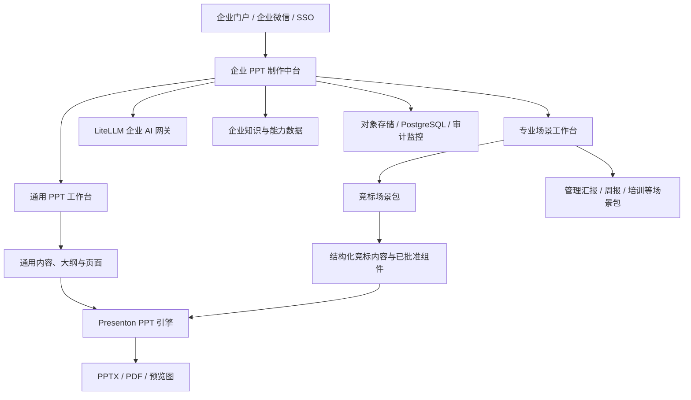
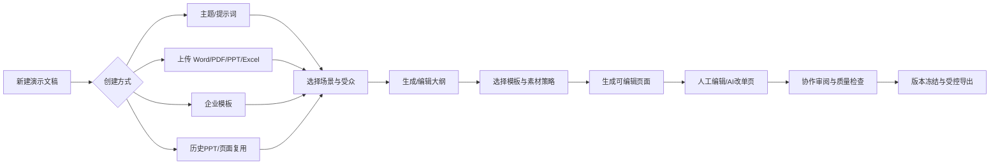
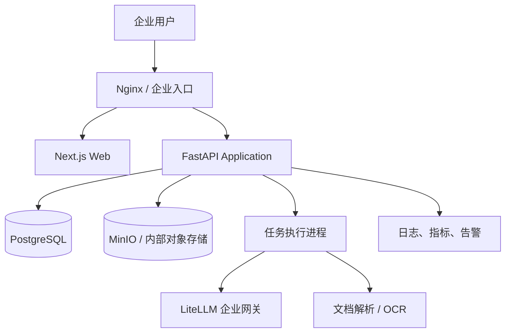

# 企业 PPT 制作中台二开开发落地方案

> 基于当前 Presenton 代码仓库的增量开发设计<br>
> 产品定位：企业级通用 PPT 工作台 + 可插拔专业场景工作台<br>
> 首个专业场景：临床项目竞标方案生成与决策协同<br>
> 文档版本：V1.0<br>
> 编制日期：2026-08-12

---

## 1. 文档目的与核心结论

本文综合以下两份材料，并结合当前仓库代码现状，形成可直接进入需求评审、技术设计和迭代排期的开发落地方案：

- `docs/second/guide.md`：明确 Presenton 企业化改造、部署、安全、模板和试点路径；
- `docs/second/竞标Agent建设规划与阶段进展_PPT文稿.md`：明确竞标 Agent 的业务定位、流程、数据、审核边界和 MVP 输出。

核心结论如下：

1. **平台主干必须是通用 PPT 工作台。** 普通员工无需进入竞标流程，即可完成从主题或资料创建、生成大纲、选择企业模板、生成和编辑页面、协作审阅、质量检查、版本管理到受控导出的完整过程。
2. **不重写 PPT 生成与编辑底座。** 当前仓库已经具备文档上传解析、大纲生成、模板生成、PPT 页面生成与编辑、对话修改、异步任务和 PPTX/PDF 导出等能力，应继续作为“演示文稿引擎”。
3. **竞标是首个可插拔专业场景，不是整个平台的数据模型。** 项目画像、需求矩阵、策略纸、专业模块和三道审核门属于竞标场景包；用户、空间、文件、模板、素材、知识、协作、版本、质量、模型和审计属于通用中台。
4. **通用流程与专业流程并存。** 普通汇报可采用“资料/主题 → 大纲 → 内容与模板 → 编辑 → 审阅 → 导出”的轻流程；竞标等高风险场景采用带业务对象和审核门的强流程。
5. **AI 只负责提取、检索、组织、起草和检查。** 通用内容由用户负责确认；医学判断、统计假设、中心可获得性、入组预测、服务承诺等专业高风险内容必须由指定责任人批准。
6. **实施采用双轨 MVP。** 平台 MVP 先交付通用工作台最小闭环；竞标 MVP 同期或随后验证 20—30 页核心竞标版，二者共享底层能力但分别验收。
7. **技术开发与业务治理必须双轨推进。** 通用平台需要品牌模板、通用素材和使用规范；竞标场景还需要专业 Owner、统一公司口径、真实试点项目、审核样例和数据 Owner。

一句话目标：

> 以当前仓库的 PPT 引擎为底座，建设一个面向全员的企业通用 PPT 工作台，并以可插拔场景包承载竞标等专业流程，实现空间有权限、资料有治理、内容可复用、生成有规则、协作有版本、发布可追溯。

---

## 2. 产品边界：通用中台、场景工作台与 PPT 引擎

为避免把全部业务逻辑继续堆入现有“生成 PPT”流程，也避免平台被竞标场景绑死，产品应拆成四个层次。

| 层次 | 定位 | 主要能力 | 当前状态 |
| --- | --- | --- | --- |
| 企业 PPT 公共中台 | 全平台公共能力 | 身份组织、空间权限、模型网关、文件、模板、素材、知识、任务、版本、质量和审计 | 部分已有，需企业化补齐 |
| 通用 PPT 工作台 | 面向全员的标准产品 | 多种创建入口、大纲、模板、生成、编辑、协作审阅、版本、导出和复用 | 基础生成编辑已有，需工作台化 |
| 专业场景工作台 | 按业务安装的场景包 | 竞标、管理汇报、项目周报、培训、医学交流等专属字段、规则、流程和审核 | 竞标优先建设 |
| Presenton PPT 引擎 | 内容呈现与交付内核 | 大纲、版式、页面生成、编辑、预览、PPTX/PDF 导出 | 当前仓库已基本具备 |

三层关系如下：



一期可以继续采用单体仓库和同一套 FastAPI 服务，但代码上必须将通用能力与场景能力分包。只有当任务吞吐、团队规模或部署边界出现明确需求时，再拆分独立服务。

### 2.1 平台能力归属原则

| 能力 | 归属 | 设计要求 |
| --- | --- | --- |
| 用户、部门、空间、成员和权限 | 公共中台 | 不出现竞标专属字段 |
| 文件、文件夹、版本、解析和引用 | 公共中台 | 任意 PPT 场景均可复用 |
| 模板、主题、素材、组件和字体 | 公共中台 | 通过标签适配场景，不为单一业务硬编码 |
| 大纲、页面、演示文稿版本和导出 | 通用工作台/PPT 引擎 | 保持轻量创建路径 |
| 评论、审阅、待办、发布和审计 | 公共中台 | 工作流策略可按场景配置 |
| 项目画像、需求矩阵、策略纸 | 竞标场景包 | 仅安装或启用竞标场景时出现 |
| 专业模块和 Gate 1/2/3 | 竞标场景包 | 通过扩展接口调用通用生成、审核、发布能力 |

### 2.2 场景扩展机制

专业场景不通过复制一套 PPT 系统实现，而是注册一个 `scene_type` 及其配置：

- 创建表单 schema；
- 必传资料类型；
- AI 任务和 Prompt 版本；
- 内容对象 schema；
- 页面/模块装配规则；
- 审核流与发布门禁；
- 推荐模板、布局、素材和质量规则；
- 场景角色及权限动作；
- 统计指标和复盘规则。

通用工作台使用 `scene_type=general`，默认不启用强制专业审核；竞标工作台使用 `scene_type=bid`，加载竞标业务对象与三道评审门。后续新增管理汇报、培训课件或项目周报时，不修改通用演示文稿核心表结构。

---

## 3. 当前仓库能力盘点

### 3.1 可直接复用的能力

以下判断来自当前代码，而非仅依据上游产品说明。

| 现有能力 | 代码位置 | 二开用途 |
| --- | --- | --- |
| Next.js 前端与仪表盘 | `servers/nextjs/app/(presentation-generator)` | 复用页面框架、编辑器、模板和生成交互 |
| FastAPI API 主体 | `servers/fastapi/api/main.py` | 新增 enterprise/bid 领域路由 |
| 用户登录、管理员和会话 | `servers/fastapi/api/v1/auth`、`api/v1/admin` | 作为一期账号体系，二期接 SSO |
| 用户资源归属隔离 | `services/database.py` 中 owner scope | 复用隔离机制，并扩展到项目成员授权 |
| 演示文稿、页面和大纲模型 | `models/sql/presentation.py`、`models/sql/slide.py` | 作为竞标版本的最终演示文稿载体 |
| 模板 V2 与自定义模板 | `models/sql/template_v2.py`、`api/v1/ppt/endpoints/template.py` | 建设企业品牌模板和标准布局 |
| 文档解析 | `services/documents_loader.py`、`liteparse_service.py`、`office_document_service.py` | 解析 RFP、方案、IB、Word/PDF 等资料 |
| AI 大纲和页面生成 | `utils/llm_calls`、`api/v1/ppt/endpoints/outlines.py`、`presentation.py` | 从批准的结构化内容组装页面 |
| 智能生成与对话修改 | `generate_smart_presentation.py`、`services/chat` | 模块草稿和单页修改，但需加入业务状态约束 |
| 异步任务 | `models/sql/async_task.py`、`api/v1/async_tasks` | 承载解析、抽取、检查、组装、导出等长任务 |
| 可编辑演示文稿导出 | Next.js export API、FastAPI export utils | 输出 PPTX/PDF 和预览材料 |
| LiteLLM 连接配置 | `docker-compose.yml` 与 LLM provider 代码 | 所有模型调用统一经企业网关 |
| 自动化测试基础 | `servers/fastapi/tests`、`servers/nextjs/tests` | 扩充业务、权限、安全和回归测试 |

### 3.2 当前底座与企业中台要求的差距

| 能力域 | 当前情况 | 需要补齐 |
| --- | --- | --- |
| 组织权限 | 主要是管理员/普通用户及 owner 隔离 | 部门、项目成员、业务角色、模板授权、数据域授权 |
| 通用工作空间 | 演示文稿按用户归属 | 个人/团队/部门空间、文件夹、成员、分享和回收站 |
| 专业项目空间 | 尚无独立业务空间 | 申办方/竞标项目级空间、专业角色、密级和生命周期 |
| 通用工作台 | 主要围绕单次生成和编辑 | 最近使用、收藏、文件夹、协作审阅、版本、发布和复用 |
| 资料治理 | 文件可上传并用于生成 | 文件指纹、业务分类、版本、有效性、解析状态、冲突规则 |
| 中间业务对象 | 大纲、结构和页面主要存在于 presentation JSON | 项目画像、需求矩阵、策略纸、模块内容必须独立持久化 |
| 来源引用 | 可将文档文本作为生成上下文 | 字段/结论/数字到文件页码或能力库记录的逐条引用 |
| 工作流 | 生成和编辑流程为主 | 策略纸门禁、模块审核、三道评审门、冻结、发布 |
| 模板治理 | 用户模板及默认模板 | 企业/部门授权、版本、发布下线、固定品牌区和审批 |
| 模型治理 | 支持多类模型配置 | 只走 LiteLLM、场景路由、敏感等级、Token/成本审计 |
| 文件存储 | 本地 `app_data` | 正式环境对象存储、病毒扫描、生命周期与下载授权 |
| 审计 | 应用日志和部分记录 | 登录、查看、上传、生成、修改、审核、导出、分享全链路审计 |
| 质量门 | 有生成和部分结构校验 | 来源、口径、残留、溢出、兼容、覆盖率、承诺审批等规则 |
| 企业集成 | 无明确企业业务接口 | SSO、组织、中心/PI、CTMS、CDE/智策、通知和门户 |

### 3.3 重要技术判断

- 当前 `owner_id` 隔离适合“个人文件”，但不足以表达团队协作和跨部门专业项目。应先建立通用 `workspace + membership`，专业场景再关联 `business_project + role assignment`，不应简单把所有成员映射成同一 owner。
- 当前 `PresentationModel` 中的 `outlines`、`structure`、`layout` 适合渲染过程，不适合承载有审批状态和来源的业务结论。业务对象需要范式化表结构，允许关键内容使用 JSONB 保存领域字段。
- 当前模板 V2 已可作为企业布局技术底座，但模板的部门范围、业务场景、版本、状态和固定元素规则需要新增元数据层，不宜直接修改模板生成核心格式。
- 当前异步任务可以复用，但企业任务还需要任务类型、项目归属、操作者、模型调用链、重试策略和业务幂等键。
- 当前本地静态文件访问已有用户授权检查基础；切换对象存储后应改为后端授权后的短时签名地址，不能把桶设为公开。

---

## 4. 双工作台目标业务闭环

### 4.1 通用 PPT 工作台主流程

通用工作台服务管理汇报、项目总结、周报月报、产品介绍、培训课件、方案宣讲、数据分析等日常场景。它必须保持低门槛，不强迫普通用户填写竞标字段或经过三道专业评审。



通用工作台需要支持四种创建模式：

| 创建模式 | 适用情况 | 系统行为 |
| --- | --- | --- |
| 从主题创建 | 用户只有题目和目标 | 生成大纲、内容与页面 |
| 从资料创建 | 已有 Word/PDF/Excel/Markdown | 先解析资料，再生成有引用的内容 |
| 从模板创建 | 已有固定企业汇报结构 | 按模板槽位引导填充或生成 |
| 从已有 PPT 创建 | 改版、摘要、扩写或复用 | 复制为新版本并保留来源关系 |

通用流程的可选控制：

- 用户可选择汇报场景、受众、时长、语言、语气、页数和保密等级；
- 部门可设置默认模板、模型、质量规则和发布审批；
- 普通草稿可由创建人直接导出，受控部门或高密级内容可配置一到两级审阅；
- 页面、图表、图片和文本组件可保存到个人或团队资产库；
- 生成后仍使用当前可编辑幻灯片编辑器，不将页面整体图片化；
- 所有工作台都能使用版本、评论、质量检查、审计和发布能力。

### 4.2 通用工作台状态

通用演示文稿默认状态：

`草稿 → 审阅中（可选） → 已批准（可选） → 已冻结 → 已发布/已导出 → 已归档`

若空间未配置审批，可从“草稿”直接进入“已冻结”；若文稿修改了已冻结内容，则创建新版本，不能覆盖历史发布版本。

### 4.3 竞标工作台端到端流程


必须落入系统的强约束：

1. RFP 与方案为一期建议必传资料；缺失时允许保存项目，但阻断正式抽取完成和后续生成。
2. 字段无法从资料确定时标记为“待确认”；推断内容必须记录推断依据和置信度，禁止悄悄补齐。
3. 投标策略纸未确认前，专业模块只能维护资料和规则，不能批量生成正式模块草稿。
4. 正式 PPT 只能引用“已批准”或“已冻结”的内容版本。
5. 高风险判断和服务承诺不存在 AI 自动批准路径。
6. 导出前必须通过客户/药物名称残留、关键数字来源、需求覆盖和未批准承诺检查。

### 4.4 竞标场景状态机

#### 项目状态

`草稿 → 资料准备 → 画像确认 → 策略确认 → 模块编制 → 专业评审 → 客户逻辑评审 → 演练冻结 → 已提交 → 已归档`

项目允许终止为 `No-Bid` 或 `已取消`，但不得物理删除其审计记录。

#### 内容项状态

`AI草稿 → 待补充资料 → 待专业审核 → 审核退回 / 已批准 → 已冻结 → 已对外发送`

#### 资料状态

`上传中 → 安全扫描 → 待分类 → 解析中 → 待确认 → 有效 / 已过期 / 已替代 / 解析失败`

状态流转统一经应用服务完成，不允许前端直接覆盖状态字段。

---

## 5. 功能架构与页面规划

### 5.1 企业中台公共能力

| 模块 | 一期能力 | 后续能力 |
| --- | --- | --- |
| 用户与组织 | 本地账号、管理员、项目成员 | 企业微信/统一 SSO、部门同步、岗位映射 |
| 模型网关 | 固定 LiteLLM、隐藏用户 Key、记录调用 | 场景路由、敏感级路由、预算和熔断 |
| 模板中心 | 企业模板、版本、发布、默认模板 | 部门授权、固定品牌区、收藏和使用分析 |
| 素材中心 | 公司口径、案例、人员、图片的最小管理 | 中心/PI、项目经验、完整授权与到期治理 |
| 文件中心 | 上传、版本、指纹、解析、下载授权 | 对象存储、病毒扫描、DLP 和生命周期 |
| 任务中心 | 解析、抽取、生成、检查、导出进度 | 队列扩容、优先级、配额、失败补偿 |
| 审计中心 | 关键动作、模型调用、导出日志 | 合规检索、告警、报表和 SIEM 对接 |
| 质量中心 | 内容与导出检查规则 | 规则配置、评测集、趋势分析 |

### 5.2 通用 PPT 工作台页面

建议把现有 dashboard、upload、outline、presentation、templates 等页面逐步纳入统一信息架构，不必一期全部重写。

| 页面 | 建议路由 | 核心交互 |
| --- | --- | --- |
| 工作台首页 | `/workspace` | 最近使用、我的草稿、待我审阅、收藏模板、快捷创建 |
| 空间与文件夹 | `/workspace/spaces/[id]` | 个人/团队/部门文件、文件夹、成员和权限 |
| 新建向导 | `/presentations/new` | 主题、资料、模板、已有 PPT 四种入口 |
| 场景选择 | `/presentations/new/scenario` | 汇报类型、受众、时长、语言、密级和输出要求 |
| 资料与大纲 | `/presentations/[id]/outline` | 资料预览、引用、大纲生成与人工调整 |
| 模板与风格 | `/presentations/[id]/design` | 企业模板、主题、字体、配色和布局建议 |
| 演示文稿编辑 | `/presentations/[id]/edit` | 复用现有编辑器、AI 改页、页面增删和备注 |
| 审阅与评论 | `/presentations/[id]/review` | 评论、问题、指派、解决、批准或退回 |
| 版本历史 | `/presentations/[id]/versions` | 自动保存版本、命名版本、比较、复制和冻结 |
| 质量报告 | `/presentations/[id]/quality` | 品牌、来源、敏感信息、溢出、字体和清晰度 |
| 发布与导出 | `/presentations/[id]/publish` | PPTX/PDF、权限、有效期、下载和发布记录 |
| 模板中心 | `/assets/templates` | 公司/部门/个人模板、筛选、预览、收藏和申请发布 |
| 素材与组件库 | `/assets/library` | 页面、图表、图片、Logo、案例和通用文案组件 |
| 我的任务 | `/tasks` | 生成任务、待审阅、失败任务和整改待办 |

通用首页不能以“创建竞标项目”为唯一入口。建议首屏保留三个并列入口：

1. **快速生成 PPT**：面向普通员工的轻流程；
2. **从企业模板开始**：面向固定结构和品牌场景；
3. **进入专业工作台**：展示用户有权使用的竞标等场景应用。

### 5.3 竞标工作台页面

建议在 Next.js 新增路由组 `app/(enterprise)/bid/`，作为通用工作台之外的专业场景页面，一期页面如下：

| 页面 | 建议路由 | 核心交互 |
| --- | --- | --- |
| 我的竞标项目 | `/bid/projects` | 查询、筛选、创建、查看状态和待办 |
| 项目驾驶舱 | `/bid/projects/[id]` | 阶段、完成度、风险、成员、待确认、最近版本 |
| 项目资料 | `/bid/projects/[id]/documents` | 上传、分类、版本确认、解析状态、冲突处理 |
| 项目画像 | `/bid/projects/[id]/profile` | 字段、来源页、置信度、确认/退回、缺口清单 |
| 需求矩阵 | `/bid/projects/[id]/requirements` | 必答项、评分项、责任部门、目标页面、覆盖状态 |
| 投标策略纸 | `/bid/projects/[id]/strategy` | 六要素编辑、证据关联、承诺审批、确认门禁 |
| 专业工作台 | `/bid/projects/[id]/modules/[code]` | 模块输入、规则、结构化结论、草稿、引用、审核 |
| 评审中心 | `/bid/projects/[id]/reviews` | Gate 1/2/3 检查、问题分派、整改和准入 |
| PPT 组装 | `/bid/projects/[id]/presentations` | 输出版本、模块选配、页面顺序、模板、生成与编辑 |
| 质量报告 | `/bid/projects/[id]/quality` | 来源、口径、覆盖、残留、溢出、承诺和兼容检查 |
| 版本与导出 | `/bid/projects/[id]/releases` | 版本差异、冻结、导出、发送登记和下载记录 |
| 答疑与复盘 | `/bid/projects/[id]/retrospective` | 问题库、回答责任人、结果、可复用资产提议 |

不建议一期重做现有幻灯片编辑器。用户在“PPT 组装”完成结构化内容装配后，跳转或嵌入现有 presentation 编辑页面进行最后的版式微调。

---

## 6. 平台化后端领域设计

### 6.1 建议代码目录

保持现有代码风格，先新增通用企业域，再以场景包扩展竞标能力，不侵入 `api/v1/ppt` 的核心生成逻辑：

```text
servers/fastapi/
├── api/v1/enterprise/
│   ├── router.py
│   ├── workspaces/
│   ├── presentations/
│   ├── reviews/
│   ├── releases/
│   ├── templates/
│   ├── assets/
│   ├── knowledge/
│   ├── scenes/
│   ├── audit/
│   └── bid/
│       ├── projects/
│       ├── documents/
│       ├── profiles/
│       ├── requirements/
│       ├── strategies/
│       ├── modules/
│       ├── reviews/
│       └── releases/
├── domains/platform/
│   ├── permissions.py
│   ├── workflows.py
│   ├── scene_registry.py
│   └── quality_rules.py
├── domains/scenes/bid/
│   ├── enums.py
│   ├── schemas.py
│   ├── policies.py
│   ├── state_machine.py
│   └── rules/
├── services/enterprise/
│   ├── workspace_service.py
│   ├── presentation_workspace_service.py
│   ├── review_workflow_service.py
│   ├── scene_service.py
│   ├── asset_library_service.py
│   ├── project_service.py
│   ├── document_ingestion_service.py
│   ├── extraction_service.py
│   ├── requirement_service.py
│   ├── strategy_service.py
│   ├── module_generation_service.py
│   ├── review_service.py
│   ├── presentation_assembly_service.py
│   ├── quality_gate_service.py
│   └── audit_service.py
└── models/sql/enterprise/
```

其中：

- API 层只处理鉴权、参数、响应和错误映射；
- service 层承载事务、状态流转、权限检查和任务编排；
- domain 层承载不依赖 Web/数据库的业务规则；
- AI prompt 与输出 schema 按通用任务/场景任务拆分并版本化，不能散落在接口函数中；
- 场景注册器提供 schema、流程、规则和模板推荐，场景包不能反向污染通用实体；
- 与当前 PPT 内核的连接只通过通用 presentation application service 和稳定的内部接口完成。

### 6.2 核心数据模型

建议 PostgreSQL 正式环境使用 UUID 主键、`created_at/updated_at`、`created_by/updated_by`、乐观锁版本号，并对状态、项目、Owner 和更新时间建立索引。

| 表/实体 | 核心字段 | 说明 |
| --- | --- | --- |
| `organizations` | name, code, status | 为未来多组织预留；一期可只有一条 |
| `departments` | organization_id, parent_id, name | 部门层级 |
| `workspaces` | organization_id, name, type, owner_id, confidentiality | 个人、团队、部门或业务空间 |
| `workspace_members` | workspace_id, user_id, role, permissions | 通用空间成员与授权 |
| `workspace_folders` | workspace_id, parent_id, name | 通用文件夹树 |
| `presentation_entries` | workspace_id, folder_id, presentation_id, scene_type, status | 在不破坏现有表的前提下补充工作台元数据 |
| `presentation_versions` | entry_id, version_no, source_version_id, snapshot_ref, change_note | 通用演示文稿版本 |
| `review_flows` | resource_type, resource_id, policy_code, status | 通用可配置审阅流程 |
| `review_tasks` | flow_id, step, assignee_id, decision, comment | 审阅、退回和批准待办 |
| `scene_definitions` | scene_type, version, config_json, status | 场景 schema、流程和能力注册 |
| `asset_items` | workspace_id, asset_type, name, payload_ref, tags, status | 页面、图表、图片、文案等通用素材 |
| `template_publications` | template_id, scope_type, scope_id, version, status, rules_json | 企业模板发布与授权元数据 |
| `quality_policies` | scope_type, scope_id, scene_type, ruleset_version | 公司/部门/场景质量策略 |
| `project_spaces` | sponsor_name, bid_code, title, phase, indication, confidentiality, status | 竞标项目空间 |
| `project_members` | project_id, user_id, role_code, department_id | 项目级授权，一人可多角色 |
| `project_documents` | project_id, category, logical_name, current_version_id | 业务文件逻辑对象 |
| `document_versions` | document_id, version_no, object_key, sha256, source_date, status | 文件实体、指纹、版本和解析状态 |
| `document_chunks` | version_id, page_no, section, text, bbox, embedding_ref | 引用定位；向量可外置 |
| `project_profiles` | project_id, version_no, status, schema_version | 项目画像版本 |
| `profile_facts` | profile_id, field_code, value_json, certainty, review_status | 原子画像字段 |
| `source_citations` | target_type, target_id, source_type, source_id, locator, quote_hash | 通用来源关联，不保存过长原文 |
| `bid_requirements` | project_id, category, text, mandatory, score, owner_role, status | RFP 必答项和评分项 |
| `requirement_responses` | requirement_id, module_id, target_slide, response_status | 需求到模块/页面的覆盖 |
| `bid_strategies` | project_id, version_no, status, confirmed_by | 投标策略纸版本 |
| `strategy_items` | strategy_id, item_type, content, rank | 判断、担忧、方案、优势、承诺等 |
| `professional_modules` | project_id, module_code, owner_id, status, generation_policy | 医学、运营、数统等实例 |
| `module_content_versions` | module_id, version_no, content_json, prompt_version, model_trace_id, status | 专业内容版本 |
| `content_components` | scope, module_code, component_type, content_json, approval_status | 可复用的企业内容组件 |
| `commitments` | project_id, content, basis, risk_level, approver_id, status | 服务承诺单独治理 |
| `review_gates` | project_id, gate_type, status, started_at, completed_at | 三道评审门 |
| `review_issues` | gate_id, target_type, target_id, severity, owner_id, due_at, status | 评审问题闭环 |
| `quality_runs` | project_id, release_id, ruleset_version, result, status | 自动质量检查批次 |
| `presentation_releases` | project_id, presentation_id, release_type, version_no, status | 连接现有 PresentationModel |
| `release_snapshots` | release_id, manifest_json, file_hash, created_by | 冻结时保存内容与引用清单 |
| `audit_events` | actor_id, action, resource_type, resource_id, project_id, result, metadata | 追加写审计日志 |
| `llm_call_records` | task_type, project_id, actor_id, model, tokens, latency, cost, sensitivity | 模型审计和成本 |

`source_citations.target_type + target_id` 是通用引用模型，可关联普通演示文稿内容块、页面元素，也可关联竞标画像字段、策略项、模块内容块和承诺。普通“从主题创建”允许标记为模型生成或用户输入；凡从上传资料或企业知识生成的关键数字都应保留引用，竞标正式版本要求关键数字来源覆盖率 100%。

### 6.3 权限模型

平台角色、空间角色与专业项目角色分开设计：

#### 平台角色

- 系统管理员：用户、组织、模型、全局策略；
- 模板管理员：企业模板、品牌规则、字体和布局发布；
- 数据管理员：企业能力数据、口径和授权；
- 审计员：只读访问审计和合规报告；
- 普通用户：只能访问获授权项目与资源。

#### 空间角色

- 空间管理员：成员、文件夹、默认模板和工作流策略；
- 编辑者：创建、编辑和发起审阅；
- 审阅者：评论、批准或退回；
- 查看者：只读或按授权下载。

#### 项目角色

- Bid Manager：项目成员、资料版本、策略确认、最终版本；
- 模块 Owner：负责指定专业模块及审核提交；
- 专业审核人：批准或退回专业内容；
- 客户视角评审人：执行 Gate 2，且需记录是否参与撰写；
- 汇报人/查看者：按授权查看、评论或下载；
- 管理层审批人：批准服务承诺及对外发布。

通用接口执行“登录校验 + 空间成员校验 + 资源动作校验”；专业场景接口在此基础上增加“项目角色 + 场景状态”校验。仅依赖前端隐藏按钮不构成权限控制。

### 6.4 API 草案

统一前缀建议为 `/api/v1/enterprise`。先提供通用工作台接口：

| 方法与路径 | 作用 |
| --- | --- |
| `POST/GET /workspaces` | 创建或查询个人、团队、部门空间 |
| `POST /workspaces/{id}/members` | 空间成员与角色授权 |
| `POST/GET /workspaces/{id}/folders` | 文件夹管理 |
| `POST /presentations` | 按主题、资料、模板或已有 PPT 创建 |
| `GET/PATCH /presentations/{id}/entry` | 查询和维护工作台元数据 |
| `POST /presentations/{id}/generate-outline` | 通用大纲生成任务 |
| `POST /presentations/{id}/generate-slides` | 通用页面生成任务 |
| `POST /presentations/{id}/versions` | 创建命名版本或快照 |
| `POST /presentations/{id}/reviews` | 按空间策略发起审阅 |
| `POST /review-tasks/{id}/decision` | 批准、退回或评论 |
| `POST /presentations/{id}/quality-runs` | 执行通用/场景质量规则 |
| `POST /presentations/{id}/freeze` | 冻结指定版本 |
| `POST /presentations/{id}/exports` | 授权导出 PPTX/PDF |
| `POST/GET /assets` | 保存、检索和复用素材/页面组件 |
| `GET /scenes` | 查询用户可用的专业场景 |

竞标场景接口在通用能力之上扩展：

| 方法与路径 | 作用 |
| --- | --- |
| `POST /bid/projects` | 创建竞标项目 |
| `GET /bid/projects` | 按权限查询项目 |
| `GET/PATCH /bid/projects/{id}` | 项目详情与允许字段修改 |
| `POST /bid/projects/{id}/members` | 项目成员和角色授权 |
| `POST /bid/projects/{id}/documents` | 初始化文件上传 |
| `POST /documents/{id}/versions` | 新增资料版本 |
| `POST /document-versions/{id}/confirm` | 确认有效版本 |
| `POST /bid/projects/{id}/extract-profile` | 创建画像抽取异步任务 |
| `GET/PATCH /bid/projects/{id}/profile` | 查询和人工确认画像字段 |
| `POST /bid/projects/{id}/extract-requirements` | 抽取 RFP 必答项/评分项 |
| `GET/PATCH /bid/projects/{id}/requirements` | 维护需求矩阵 |
| `POST /bid/projects/{id}/strategy/generate` | 起草策略纸 |
| `POST /bid/projects/{id}/strategy/confirm` | Bid Manager 确认门禁 |
| `POST /bid/projects/{id}/modules/{code}/generate` | 生成指定模块草稿 |
| `POST /module-content/{id}/submit` | 提交专业审核 |
| `POST /module-content/{id}/approve` | 审核批准 |
| `POST /bid/projects/{id}/reviews/{gate}/run` | 执行自动检查并开启评审 |
| `POST /review-issues/{id}/resolve` | 整改问题 |
| `POST /bid/projects/{id}/presentations/assemble` | 从已批准内容创建演示文稿 |
| `POST /presentation-releases/{id}/freeze` | 冻结版本和快照 |
| `POST /presentation-releases/{id}/export` | 检查通过后导出 |
| `GET /bid/projects/{id}/audit-events` | 项目审计轨迹 |

创建任务类接口返回当前异步任务 ID，前端复用现有任务查询机制展示进度。接口必须支持幂等键，避免用户重复点击导致重复抽取或生成。

---

## 7. AI 编排设计

### 7.1 任务拆分

通用工作台提供以下公共 AI 任务，专业场景可以组合使用或追加约束：

| 公共任务 | 输入 | 输出 | 适用场景 |
| --- | --- | --- | --- |
| 意图与受众分析 | 主题、场景、受众、时长 | 汇报目标、内容策略、建议页数 | 所有 PPT |
| 文档解析与摘要 | Word/PDF/PPT/Excel 等 | 章节、事实、表格和引用 | 从资料创建 |
| 大纲生成/重写 | 用户输入、资料、模板槽位 | 可编辑结构化大纲 | 所有 PPT |
| 页面内容生成 | 大纲、素材、知识和风格 | 结构化页面内容 | 所有 PPT |
| 布局匹配 | 页面语义、内容密度、模板标签 | 布局 ID 与映射数据 | 所有 PPT |
| 单页改写 | 当前页、用户指令、上下文 | 页面内容或 UI patch | 编辑阶段 |
| 摘要/扩写/版本转换 | 现有 PPT 和目标要求 | 新大纲与页面映射 | 摘要版、详版、改版 |
| 图表建议 | 表格/数据、表达目标 | 图表类型、配置和说明 | 数据汇报 |
| 讲稿与问答 | 最终页面、受众、时长 | 演讲备注和候选问题 | 汇报准备 |
| 质量语义检查 | 全文、质量策略 | 重复、逻辑断层、语气和敏感风险 | 发布前 |

竞标场景不得使用一个超长 Prompt 生成全部内容，而是在公共任务之上按可评测的原子业务任务拆分：

| 任务 | 输入 | 结构化输出 | 人工责任 |
| --- | --- | --- | --- |
| 文件分类与版本识别 | 文件元数据、首页和目录 | 文件类型、项目、日期、疑似版本 | Bid Manager 确认 |
| 项目画像抽取 | 已确认 RFP/方案/IB | Profile schema + 来源 + 置信度 | 医学确认 |
| 需求抽取 | RFP、会议纪要 | 必答项、评分项、客户问题、待澄清项 | Bid Manager 确认 |
| 资料冲突检测 | 多版本事实 | 冲突字段、两侧来源、建议优先级 | Owner 选择 |
| 策略纸起草 | 画像、矩阵、企业能力、历史案例 | 六类策略项及证据 | Bid Manager/管理层确认 |
| 模块规划 | 策略纸、装配规则、采购范围 | 模块清单、页数、输入缺口 | 各模块 Owner 确认 |
| 专业草稿 | 批准的上游对象、规则、来源 | 结构化内容块和页面建议 | 专业负责人审核 |
| 一致性检查 | 全部模块和版本 | 数字、名称、时间、承诺冲突 | 责任人整改 |
| PPT 组装 | 已批准组件、模板和版本类型 | Presentation/slide payload | Bid Manager 检查 |
| 答疑模拟 | 项目画像、风险、最终版本 | 问题、建议回答、应答人、证据 | 人工演练 |

### 7.2 结构化输出约束

每个公共或场景 AI 任务必须：

- 使用 Pydantic/JSON Schema 定义输出，不把 Markdown 长文作为唯一结果；
- 返回 `value`、`source_refs`、`certainty`、`assumptions`、`missing_fields`；
- 对“事实、推断、建议、承诺”使用不同类型标记；
- 校验失败时有限次数自动修复，仍失败则进入人工处理；
- 记录 prompt 版本、模型、参数、输入文件版本和调用追踪 ID；
- 不把未经确认的历史聊天记忆作为正式事实来源；
- 将当前项目上下文与公共知识检索严格分区，避免跨申办方信息污染。

### 7.3 模型路由

一期通过 LiteLLM 统一路由，应用只使用能力/场景别名，不硬编码具体厂商模型：

| 场景别名 | 任务特点 | 建议策略 |
| --- | --- | --- |
| `ppt-general-fast` | 通用大纲、改写、摘要 | 快速模型，控制成本 |
| `ppt-general-quality` | 管理层材料、关键叙事和润色 | 高质量模型 |
| `ppt-structure-extract` | 文档结构和表格抽取 | 低温度、结构化输出 |
| `ppt-layout-assist` | 页面内容到布局匹配 | 结构化输出，不生成自由版式代码 |
| `bid-extract-fast` | 字段抽取、分类 | 低温度、支持结构化输出的快速模型 |
| `bid-reasoning-high` | 策略、复杂专业草稿 | 高质量模型，强制来源和人工审核 |
| `bid-rewrite-fast` | 压缩、改写、格式化 | 快速模型 |
| `bid-sensitive-internal` | 高敏项目 | 仅企业批准的内部模型通道 |
| `bid-quality-check` | 残留、一致性、覆盖检查 | 规则优先，模型只补充语义检查 |

模型不可用时应清晰失败或降级到已批准的备选模型，不能静默绕过企业网关。

### 7.4 知识检索策略

一期优先实现“可追溯检索”，而不是追求复杂 Agent 自主研究。检索范围分为四层：个人资料、团队/部门知识、企业公共知识和专业项目知识。

1. 通用资料按所属个人、团队或部门空间建立权限边界；
2. 专业项目资料按项目空间进一步隔离；
3. 企业能力库和公共素材按数据授权范围过滤；
4. 外部知识库按来源、地区、日期和证据等级过滤；
5. 检索前先做权限过滤，不能先检索再在结果层脱敏；
6. 引用保存文档版本、页码/段落、记录 ID 和内容哈希；
7. 原文件版本失效后，引用状态自动变为待复核。

一期不必先建设大型知识图谱。PostgreSQL + 结构化事实表 + 可替换的向量索引已经足以验证闭环。

---

## 8. 通用生成、专业组装与品牌模板落地

### 8.1 通用 PPT 生成原则

通用工作台继续复用现有“输入 → 大纲 → 模板 → 页面”的生成内核，但在外围补充工作空间、资料引用、版本和质量策略。通用生成请求至少携带：

- `workspace_id` 与创建人；
- `scene_type=general` 或轻量场景标签；
- 创建方式、受众、时长、语言和页数；
- 输入资料版本和允许使用的知识范围；
- 企业模板版本与品牌规则；
- 模型路由、保密等级和质量策略。

通用工作台允许用户在大纲、模板和页面三个阶段自由调整，不设置竞标策略纸等专业门禁。若部门配置发布审批，则在导出前进入通用 review flow。

### 8.2 专业场景组装原则

竞标等专业场景中，PPT 引擎不能直接阅读全部原始项目资料自由发挥。`presentation_assembly_service` 应接收一个冻结前的场景组装清单：

```json
{
  "project_id": "uuid",
  "release_type": "management-summary",
  "template_id": "enterprise-template-version-id",
  "strategy_version": 3,
  "modules": [
    {"code": "overview", "content_version": 2},
    {"code": "medical", "content_version": 5},
    {"code": "operations", "content_version": 4},
    {"code": "stats", "content_version": 2}
  ],
  "citation_mode": "speaker-notes-and-manifest"
}
```

服务端校验所有引用内容的状态、权限和来源后，才把内容映射为现有 `PresentationModel`、大纲、页面和模板布局。

### 8.3 竞标场景三种输出版本

| 版本 | 建议页数 | 一期支持 | 组装策略 |
| --- | ---: | --- | --- |
| 管理层摘要版 | 20—30 页 | 是 | 核心判断、策略、关键方案、风险与承诺 |
| 正式汇报版 | 60—80 页 | 二期 | 完整专业主线和现场汇报节奏 |
| 完整技术标书 | 120—150 页 | 后续 | 主文 + 专项模块 + 证据附件 |

### 8.4 企业模板建设

一期布局不能只覆盖竞标页面。建议建设 20—25 个企业通用布局，其中竞标优先验证 15—20 个：

- 封面、目录、章节页；
- 单栏、双栏、三栏内容页；
- KPI 卡片、表格、柱图、折线图；
- 流程、时间轴、组织架构、系统架构；
- 图文介绍、对比、问题与方案、案例、团队、里程碑；
- 周报/月报、项目状态、经营指标和行动计划；
- 中心/PI 推荐、项目经验、风险矩阵、策略链；
- 关键结论、下一步、Q&A、尾页。

在现有 Template V2 外增加企业模板元数据：

- `business_scene`：竞标/管理汇报/培训等；
- `scope_type/scope_id`：公司或部门；
- `version/status`：草稿、审核、已发布、已下线；
- `brand_rules`：Logo、页眉页脚、字体、色板、安全边距；
- `locked_elements`：禁止普通用户移动或删除的品牌元素；
- `layout_tags`：模块、内容密度、图表类型、适用版本；
- `compatibility_status`：Office/WPS 测试结果。

模型选择布局时依据标签和内容 schema，不仅依赖自然语言相似度。

模板中心需要同时支持：

- 企业模板：品牌管理员发布，全公司可见；
- 部门模板：仅指定部门使用；
- 场景模板：与 `scene_type` 关联，如竞标、周报、培训；
- 团队模板：团队空间内共享；
- 个人模板：用户私有草稿，不作为企业标准。

专业场景可以推荐或强制某些模板，但不得阻止通用工作台使用企业通用模板。

---

## 9. 分层质量规则与专业审核门

### 9.1 通用 PPT 质量检查

所有演示文稿默认执行一套公共质量规则：

- 企业 Logo、色板、字体、页眉页脚和安全边距；
- 文字溢出、元素越界、字号过小和页面内容过密；
- 图片分辨率、拉伸、缺失资源和版权/授权标记；
- 标题层级、页码、目录和章节一致性；
- 专有名词、数字、日期和单位的全文一致性；
- 敏感词、个人信息和疑似外部客户信息；
- 上传资料生成内容的引用完整性；
- PowerPoint/WPS 兼容性和导出完整性。

通用质量检查按严重程度分为 `提示、警告、阻断`。个人草稿可仅提示；企业正式模板、受控空间或高密级文稿可由质量策略将某些规则升级为导出阻断。

### 9.2 可配置审阅策略

通用工作台默认允许轻流程，空间管理员可以配置：

| 策略 | 适用范围 | 发布路径 |
| --- | --- | --- |
| 无审批 | 个人草稿、内部临时交流 | 创建人检查后导出 |
| 单级审阅 | 部门汇报、培训材料 | 创建人 → 审阅人 → 发布 |
| 双级审批 | 管理层/对外材料 | 内容审阅 → 品牌/合规审批 → 发布 |
| 场景工作流 | 竞标等专业场景 | 由场景包定义专属审核门 |

以下 Gate 1/2/3 是竞标场景在通用质量与审阅能力上的扩展。

### 9.3 Gate 1：专业正确性前置检查

机器可检查：

- 是否存在无来源关键数字；
- 中心/PI 是否来自有效能力库记录；
- 画像和模块使用的资料版本是否一致；
- 是否存在未处理的资料冲突或待确认字段；
- 专业模块是否完成对应 Owner 审核。

机器不可批准：医学结论、统计假设、入组可行性和时间计划。

### 9.4 Gate 2：客户决策逻辑检查

- RFP 必答项覆盖率必须为 100%；
- 承诺条目必须全部有依据并完成审批；
- 项目定制页面占比目标不低于 65%；
- 通用正文页面占比目标不高于 20%；
- 识别未回答的客户明确问题；
- 执行“换药名测试”，输出疑似通用页面供人工复核。

### 9.5 Gate 3：导出与演练检查

- 其他客户、药物名称和项目编码残留为 0；
- 关键数字跨页一致性通过；
- 未批准内容和承诺为 0；
- 页数与预计汇报时长符合目标；
- 文字溢出、元素越界、低清图片和缺失字体检查通过；
- PowerPoint/WPS 兼容性测试集通过；
- 正式冻结后生成不可变 release snapshot 和文件哈希。

质量规则应采用“确定性规则优先、模型语义检查补充”的策略。名称、数字、状态、权限、字体和越界等问题不应交给大模型判断。

---

## 10. 安全、合规与审计

### 10.1 默认安全基线

- `CAN_CHANGE_KEYS=false`，前端不允许用户配置外部模型密钥；
- `DISABLE_ANONYMOUS_TRACKING=true`；
- `WEB_GROUNDING=false`，按审批逐场景开放；
- `DISABLE_IMAGE_GENERATION=true`，一期不调用公网图片生成；
- 关闭 Pexels、Pixabay 等公网图库；
- 高敏项目只允许指定的 LiteLLM 路由；
- 数据库、对象存储、日志和备份全部位于批准环境；
- 上传文件设置类型、大小和压缩包限制，并进行病毒扫描；
- 临时解析文件任务结束后清理，失败任务也要有兜底清理机制；
- 导出和下载通过服务端授权，签名链接短时有效；
- 日志禁止记录完整项目正文、模型密钥和会话令牌。

### 10.2 数据分级建议

| 等级 | 示例 | 模型与复用策略 |
| --- | --- | --- |
| L1 公开 | 已公开公司介绍、公开指南 | 批准模型可用，可进入公共库 |
| L2 内部 | 内部模板、一般流程、脱敏案例 | 企业网关，可按部门复用 |
| L3 保密 | RFP、方案、IB、客户纪要 | 项目隔离，仅授权成员和批准模型 |
| L4 严格保密 | 未公开结果、敏感商业承诺、身份信息 | 内部模型或禁止 AI，禁止跨项目复用 |

### 10.3 必须审计的事件

登录失败/成功、空间与成员变更、演示文稿创建/移动/分享、项目创建与成员变更、文件上传/查看/下载/删除、有效版本切换、AI 任务调用、人工字段修改、评论与审阅、审核批准/退回、承诺审批、模板/素材发布、质量规则执行、版本冻结、导出和对外发送登记。

审计日志采用追加写；业务管理员不得修改历史审计事件。正式环境设置保留期、归档和异常告警策略。

---

## 11. 部署与运行架构

### 11.1 POC/开发环境

沿用当前 Docker Compose，单机部署：

- Next.js + FastAPI + Nginx；
- SQLite 或独立 PostgreSQL；
- `app_data` 持久化卷；
- LiteLLM 使用企业测试网关；
- 关闭公网搜索、图库、遥测和图片生成；
- 固定 Git commit 或内部镜像版本，不使用不可追溯的 `latest`。

### 11.2 正式试点环境



建议配置：

- Web/API 节点：8—16 核、32 GB 内存起；
- PostgreSQL：4—8 核、16 GB 内存起；
- 对象存储：500 GB 起，并设置版本和生命周期；
- 测试、预生产、生产环境分离；
- 数据库与文件每日备份，定期做恢复演练；
- 图片生成或本地模型作为独立服务，不与主应用做不可拆分部署。

一期可先复用数据库型异步任务；若并发和稳定性验证表明不足，再引入 Redis/Celery 或企业任务平台。不要在没有容量数据前增加不必要的中间件。

### 11.3 数据库迁移

- 所有新表通过 Alembic 迁移，不使用运行时 `create_all` 作为正式升级方案；
- 迁移先在生产备份副本演练；
- 大字段、索引和约束采用可回滚的分步迁移；
- 原有 presentation/template/user 数据不做破坏性重构；
- 通过关联表连接新业务对象和原有演示文稿，降低上游合并成本。

---

## 12. 分阶段开发计划

计划采用“通用平台主线 + 竞标场景主线”双轨推进，以能力和业务输入具备为进入条件，不以日历时间机械推进。以下为 1 名前端、1 名后端、0.5—1 名 AI 工程师并有业务 Owner 配合时的建议节奏。

### 阶段 0：底座验证与需求冻结（第 1—2 周）

#### 技术工作

- 固定当前二开基线版本并建立上游同步策略；
- 验证 LiteLLM、中文字体、PPTX/PDF、Office/WPS；
- 枚举所有外部调用和默认配置；
- 验证多用户资源隔离和静态文件授权；
- 用一份普通管理汇报资料和一个脱敏竞标项目分别跑通“上传 → 大纲 → 生成 → 编辑 → 导出”。

#### 业务工作

- 确认 3—5 个通用 PPT 高频场景、目标用户和现状基线；
- 确认企业品牌规范、通用模板 Owner 和第一批通用布局；
- 确认真实 III 期试点项目及资料授权；
- 确认 Bid Manager、医学、运营、数统、PV、QA Owner；
- 每个首期模块完成“输入、字段、规则、输出、AI 边界、审核人、样例”；
- 建立公司口径库 V1 和允许对外使用的素材清单；
- 冻结项目画像、需求矩阵、策略纸和首期输出 schema。

#### 退出条件

- 四项底座验证通过：品牌、中文排版、可编辑导出、数据不外传；
- 通用试点与竞标试点、Owner、数据权限、双 MVP 验收集全部明确；
- 安全评估不存在阻断项。

### 阶段 1：通用企业底座最小改造（第 3—4 周）

- 企业路由与领域目录；
- workspace、membership、folder、presentation entry/version 基础表；
- 通用文件版本、审阅流程、发布记录和 audit 基础表；
- 个人/团队空间、工作台首页和统一新建入口；
- 空间权限策略和接口级隔离测试；
- LiteLLM 场景别名、调用记录和敏感等级；
- 企业模板元数据、第一批 5 个核心布局；
- 异步任务的空间归属、幂等和错误展示。

里程碑：普通用户无需进入竞标场景，即可在个人或团队空间创建、管理和安全访问演示文稿，管理员可以追踪关键操作。

### 阶段 2：通用 PPT 工作台 MVP（第 5—6 周）

- 主题、资料、模板、已有 PPT 四种创建入口；
- 场景、受众、时长、语言、页数和密级设置；
- 通用资料解析、引用、大纲生成和模板推荐；
- 对现有编辑器进行工作台接入，不重做编辑内核；
- 评论、单级审阅、命名版本、冻结和受控导出；
- 企业模板 10—15 个通用布局；
- 品牌、溢出、字体、图片、敏感信息和兼容性检查；
- 管理汇报、项目总结、培训课件等 3 类场景试用。

里程碑：普通员工可以完成“创建 → 生成 → 编辑 → 审阅 → 版本 → 质量检查 → 导出”的通用闭环。

### 阶段 3：竞标项目理解与策略门禁（第 7—8 周）

- 在通用 workspace/document/audit 能力上增加 project space 和竞标角色；
- 文档分类、解析、切片和引用定位；
- 项目画像抽取、字段审核、缺口与冲突处理；
- RFP 需求矩阵抽取、人工维护和责任分派；
- 策略纸生成、编辑、证据关联和确认门禁；
- Prompt/schema 版本记录和抽取评测；
- 项目画像与需求矩阵导出。

里程碑：系统能从真实资料生成可逐项审核和追溯的项目画像、需求矩阵及策略纸，策略纸未确认时阻断模块正式生成。

### 阶段 4：竞标专业模块与审核闭环（第 9—11 周）

- 医学、运营、数统三个首期专业工作台；
- 模块装配规则和输入完整性检查；
- 专业草稿、结构化内容版本和引用；
- 提交、退回、批准、评论和待办；
- 承诺实体及管理层审批；
- Gate 1 与 Gate 2 自动检查、问题整改闭环；
- 需求覆盖、来源覆盖、口径冲突和残留检查。

里程碑：三个专业模块能共享同一画像和策略口径，并完成“AI 草稿 → 人工审核 → 已批准”的全过程。

### 阶段 5：专业组装与双场景试点（第 12—14 周）

- 通用布局补齐至 20—25 个，其中验证 15—20 个竞标高频布局；
- 20—30 页管理层摘要版组装；
- 已批准内容到现有 Presentation/Slide 的映射；
- 现有编辑器内的引用提示和内容状态提示；
- Gate 3、版本冻结、快照、导出授权和下载审计；
- 中文溢出、图片清晰度、字体和 Office/WPS 兼容测试；
- 通用工作台 20—50 人试用和体验指标复盘；
- 真实竞标项目试运行、问题修复和业务效果复盘。

里程碑：通用工作台可独立服务日常 PPT，竞标场景可生成可编辑的核心 PPT 并完成三道评审、冻结和受控导出。

### 阶段 6：试点后平台化

- SSO/组织同步与消息待办；
- 团队协作增强、页面级版本比较和资产复用分析；
- 管理汇报、周报/月报、培训等更多场景包；
- 企业能力库完整治理；
- 中心/PI、CTMS、智策/CDE 数据接入；
- PV、QA、临床药理等更多专业模块；
- 60—80 页正式汇报版和完整附件；
- 答疑模拟、演讲稿、复盘与优秀组件入库；
- 用量、质量、成本和资产复用看板。

---

## 13. 可执行研发 Backlog

### 平台主干 Backlog

#### Epic P1：空间、组织与权限

- P1.1 个人、团队和部门空间；
- P1.2 空间成员、角色和动作权限；
- P1.3 文件夹、移动、收藏、归档和回收站；
- P1.4 密级、模型路由和下载策略；
- P1.5 越权访问、枚举 ID 和文件地址安全测试。

#### Epic P2：通用 PPT 创建与管理

- P2.1 主题、资料、模板、已有 PPT 四种入口；
- P2.2 场景、受众、时长、语言和页数设置；
- P2.3 最近使用、我的草稿、待我审阅和收藏；
- P2.4 通用大纲生成、修改和版本；
- P2.5 现有编辑器接入统一工作台；
- P2.6 摘要、扩写、改版和复制为新文稿。

#### Epic P3：通用资料、知识与引用

- P3.1 文件逻辑对象、SHA-256 指纹和版本；
- P3.2 Word/PDF/PPT/Excel/Markdown 分类与解析；
- P3.3 个人、团队、部门、企业四级知识范围；
- P3.4 页面/内容到来源的引用；
- P3.5 临时文件清理、下载授权和对象存储适配；
- P3.6 权限过滤后的知识检索。

#### Epic P4：模板、素材与组件

- P4.1 企业/部门/场景/团队/个人模板；
- P4.2 模板版本、审核、发布、下线和授权；
- P4.3 通用布局 20—25 个及标签体系；
- P4.4 页面、图表、图片、文案组件库；
- P4.5 个人收藏和团队复用；
- P4.6 固定品牌区、字体和兼容状态。

#### Epic P5：协作、版本与发布

- P5.1 评论、指派、解决和待办；
- P5.2 无审批/单级/双级审阅策略；
- P5.3 自动保存、命名版本、复制和版本比较；
- P5.4 冻结快照、manifest 和文件哈希；
- P5.5 受控导出、有效期、下载和发送登记；
- P5.6 发布版本修改时强制创建新版本。

#### Epic P6：通用质量与 AI 治理

- P6.1 品牌、溢出、字体、图片和兼容检查；
- P6.2 名称、数字、日期、单位和敏感信息检查；
- P6.3 LiteLLM 能力别名、降级和失败策略；
- P6.4 Prompt/schema 版本及模型调用记录；
- P6.5 Token、耗时、成本、配额和使用统计；
- P6.6 质量策略的提示/警告/阻断配置。

#### Epic P7：场景扩展框架

- P7.1 `scene_type` 与场景定义注册；
- P7.2 创建表单和内容 schema 扩展；
- P7.3 场景 AI 任务与模板推荐；
- P7.4 场景工作流、角色和质量规则；
- P7.5 场景数据与通用 Presentation 的关联；
- P7.6 禁止场景字段侵入通用演示文稿核心表。

### 竞标场景包 Backlog

#### Epic B1：竞标项目与资料治理

- B1.1 创建、查询、修改和归档竞标项目；
- B1.2 项目成员、专业角色和权限；
- B1.3 RFP/方案/IB 分类、有效版本和替代关系；
- B1.4 项目级索引、密级和模型约束；
- B1.5 竞标项目审计和跨项目泄漏测试。

#### Epic B2：项目理解、需求与策略

- B2.1 项目画像 schema、抽取、来源和字段审核；
- B2.2 置信度、推断、待确认和资料冲突；
- B2.3 RFP 必答项、评分项和需求覆盖；
- B2.4 需求—责任人—模块—页面映射；
- B2.5 策略纸六类要素、证据与承诺；
- B2.6 策略确认门禁和黄金测试集。

#### Epic B3：专业模块工作台

- B3.1 模块类型与动态装配规则；
- B3.2 医学模块 V1；
- B3.3 运营模块 V1；
- B3.4 数统模块 V1；
- B3.5 共享项目输入版本提示；
- B3.6 内容版本、提交、退回和批准；
- B3.7 专业 Prompt、模型和来源追踪。

#### Epic B4：专业评审、组装与发布

- B4.1 Gate 1/2/3 状态机和整改闭环；
- B4.2 无来源数字、需求覆盖和口径冲突；
- B4.3 客户/药物残留与项目定制化检查；
- B4.4 未批准承诺和内容阻断；
- B4.5 已批准内容组装 manifest；
- B4.6 20—30 页摘要版与现有编辑器联动；
- B4.7 专业 release snapshot 和对外发送登记。

### 运行保障 Backlog

- O1 全链路审计、监控、告警和任务积压；
- O2 数据备份、对象文件恢复和灾备演练；
- O3 配置安全基线、依赖和许可证检查；
- O4 Office/WPS、字体、导出和历史文稿回归；
- O5 上游版本同步、冲突记录和内部镜像发布。

---

## 14. 测试与验收方案

### 14.1 测试分层

| 层次 | 重点 |
| --- | --- |
| 单元测试 | 状态机、权限策略、装配规则、来源规则、质量规则 |
| API 集成测试 | 空间/项目隔离、事务、幂等、状态门禁、异常响应 |
| AI 契约测试 | Schema 合法率、缺失字段处理、引用完整性、拒绝越界推断 |
| 黄金集评测 | RFP 必答项、项目画像、残留、口径冲突和模块问题命中 |
| E2E 测试 | 通用创建到导出、竞标项目到冻结导出两条核心链路 |
| 安全测试 | 越权、文件路径、上传、提示注入、跨空间/项目检索、日志泄漏 |
| 导出回归 | PPTX/PDF、Office/WPS、中文字体、溢出和可编辑性 |
| 灾备测试 | 数据库和对象文件备份恢复、任务失败补偿 |

### 14.2 通用工作台 MVP 验收指标

| 维度 | 指标 | 目标 |
| --- | --- | ---: |
| 可用性 | 四种创建入口核心链路 | 通过 |
| 生成 | 10 页普通 PPT 生成成功率 | ≥95% |
| 性能 | 10 页普通模式生成时间 | ≤5 分钟 |
| 编辑 | 文本、图片、表格、图表等主要元素可编辑 | 通过 |
| 品牌 | 企业模板 Logo、页眉页脚、色板符合率 | 100% |
| 排版 | 核心测试集无明显文字溢出或元素越界 | 通过 |
| 兼容 | Office/WPS 通用核心布局无严重错位 | 通过 |
| 协作 | 评论、审阅、退回、批准和待办链路 | 通过 |
| 版本 | 冻结版本不可被覆盖，历史版本可追溯 | 通过 |
| 权限 | 未授权跨空间访问 | 0 |
| 安全 | 用户绕过网关配置外部 Key | 0 |
| 审计 | 创建、生成、审阅、冻结和导出可追溯 | 100% |
| 体验 | 20—50 人试点综合评分 | ≥4/5 |

### 14.3 竞标场景 MVP 验收指标

| 维度 | 指标 | 目标 |
| --- | --- | ---: |
| 项目理解 | RFP 必答项识别准确率 | ≥95% |
| 项目理解 | 药物关键字段提取准确率 | ≥95% |
| 覆盖 | 客户必答问题覆盖率 | 100% |
| 来源 | 正式版本关键数字来源覆盖率 | 100% |
| 审核 | 高风险结论人工审核率 | 100% |
| 承诺 | 未经批准的 AI 服务承诺 | 0 |
| 定制 | 项目定制页面占正文比例 | ≥65% |
| 通用 | 通用正文页面占比 | ≤20% |
| 一致性 | 已知公司口径冲突检出率 | 100% |
| 合规 | 测试集中的其他客户/药物残留检出率 | 100% |
| 生成 | 生成任务成功率 | ≥95% |
| 导出 | PPTX 主要元素可编辑 | 通过 |
| 品牌 | Logo、页眉页脚、色板符合模板 | 100% |
| 兼容 | Office/WPS 核心布局无严重错位 | 通过 |
| 安全 | 未授权跨项目访问 | 0 |
| 效率 | 真实试点初稿准备时间降低 | ≥50% |
| 体验 | 试点用户综合评分 | ≥4/5 |

准确率必须基于业务 Owner 标注的真实评测集计算，不能用开发人员自建示例代替。每个首期专业模块至少提供：优秀、基本可用、不可接受各 1 个样例，5—10 个必须命中问题，5—10 个必须拒绝或转人工的问题。

### 14.4 发布准入

上线试点前至少满足：

- 无 P0/P1 安全缺陷；
- 通用空间、专业项目隔离、文件授权和状态门禁测试通过；
- 通用工作台指标和竞标场景指标分别在各自试点上达标；
- Office/WPS 回归通过；
- 备份恢复演练成功；
- 业务 Owner、数据 Owner、运维 Owner 和应急联系人明确；
- 用户手册、数据使用提示和问题反馈流程就绪。

---

## 15. 业务治理并行工作包

技术团队启动开发的同时，业务侧应并行交付以下资产。

| 工作包 | 交付物 | Owner 建议 | 与研发的依赖关系 |
| --- | --- | --- | --- |
| 通用场景盘点 | 管理汇报、周报、培训等高频任务、用户旅程和基线 | 产品/各部门代表 | 决定通用工作台入口与优先级 |
| 品牌与模板治理 | 品牌规范、通用模板、布局标签和发布流程 | 品牌/设计 | 决定全平台 PPT 视觉质量 |
| 通用素材治理 | Logo、图片、图标、标准文案、页面组件及授权 | 品牌/行政/法务 | 决定素材中心可用范围 |
| 空间与审阅策略 | 部门空间、角色、分享、导出和审批规则 | IT/信息安全/部门负责人 | 决定权限和通用工作流 |
| 专业规则共创 | 各模块字段、规则、例外、审核边界、样例 | 医学/运营/数统/PV/QA | 决定 schema、规则和评测集 |
| 公司口径治理 | 公司数字、资质、团队、系统能力统一口径 | BD/品牌 | 决定可引用事实 |
| 项目经验治理 | 脱敏案例、治疗领域、阶段、结果、授权 | PMO | 决定案例检索和差异化 |
| 中心/PI 治理 | 标准名称、表现、日期、来源和 Owner | 运营 | 二期推荐与承诺依据 |
| 人员素材治理 | 可对外简历、经验、可用性和本人确认 | HR/运营 | 团队页面自动组装 |
| 模板组件化 | 20—25 个通用布局及竞标布局验收稿 | 品牌/设计 | 决定通用与专业场景表现 |
| 双轨试点与基线 | 通用用户试点 + 真实竞标项目及投入基线 | 产品/Bid Manager | 分别评价平台价值与专业价值 |

业务经验不能只以历史 PPT 文件交付给 IT。每个模块至少必须转化成三类可开发输入：**字段、规则、验收样例**。

---

## 16. 主要风险与控制措施

| 风险 | 早期信号 | 控制措施 |
| --- | --- | --- |
| 平台被竞标场景绑死 | 首页、表结构和接口都围绕竞标项目 | 通用空间/文稿先行，竞标通过 scene_type 扩展 |
| 通用工作台退化为简单生成器 | 需求只讨论模型和页面数量 | 把空间、协作、版本、模板、质量和发布纳入平台 MVP |
| 竞标退化为普通 AI PPT | 缺少画像、策略和专业审核 | 画像、策略纸、审核门作为竞标 MVP 必选项 |
| 一期范围失控 | 要求同时完成全专业、全数据、完整标书 | 坚持三个模块、一个项目、20—30 页摘要版 |
| 企业数据不可用 | 数据无来源、无日期、无 Owner、无授权 | 不合格数据禁止进入正式内容，治理先行 |
| 专业规则无法落地 | 只提供历史 PPT，不提供判断条件 | 模块访谈模板 + 正反样例 + Owner 签字确认 |
| 跨空间/项目信息泄漏 | 共用向量索引无权限过滤 | 空间/项目级过滤、检索前鉴权、泄漏专项测试 |
| AI 生成错误承诺 | Prompt 中允许模型自由填周期和中心 | 承诺独立实体、默认禁止生成、管理层审批 |
| PPT 可看但不可编辑 | 页面被整体转为图片 | 验收文本、图表、表格等主要元素可编辑 |
| 上游升级冲突 | 大量修改现有 PPT 核心文件 | 新增领域包、稳定内部接口、记录上游同步清单 |
| 版本冻结后内容漂移 | 导出重新读取最新内容 | 冻结 snapshot、输入版本 manifest 和文件哈希 |
| 只看模型演示不看真实流程 | POC 仅使用虚构短材料 | 同时采用真实日常汇报和授权真实 III 期项目验证 |

---

## 17. 需要管理层与业务确认的决策

进入正式排期前，必须确认：

1. 是否认可“公共中台 + 通用 PPT 工作台 + 专业场景工作台 + PPT 引擎”的四层定位；
2. 通用工作台首批选择哪些场景，建议为管理汇报、项目总结、周报/月报和培训课件中的 3 类；
3. 通用工作台试点部门和 20—50 名试点用户是谁；
4. 企业模板、通用素材、空间权限和正式发布规则分别由谁负责；
5. 哪个真实 III 期项目作为竞标 MVP 试点，资料的使用和模型边界是什么；
6. Bid Manager 以及医学、运营、数统、PV、QA 模块 Owner 分别是谁；
7. 公司口径、案例、人员、中心/PI 数据 Owner 分别是谁；
8. 哪些内容允许 AI 起草，哪些只能检索建议，哪些禁止 AI 处理；
9. 哪些模型路由可处理 L3/L4 数据；
10. 竞标一期是否接受“医学 + 运营 + 数统、20—30 页摘要版”的范围；
11. 通用审阅人、专业审核人、承诺审批人和最终对外发布人是谁；
12. 两套 MVP 评测集、当前基线和验收指标分别由谁确认；
13. 正式试点使用本地存储还是直接建设对象存储，SSO 放一期还是试点后。

建议默认决策：一期使用现有账号体系完成小范围受控试点，先上线通用工作台最小闭环，再启用竞标场景包；SSO 和完整企业系统集成放在闭环验证之后。但通用空间隔离、版本、审计和导出控制，以及竞标来源追溯和审核门均不能后补。

---

## 18. 推荐的立即行动清单

### 未来 5 个工作日

1. 确认代码基线、内部仓库分支策略和负责人；
2. 用当前代码部署隔离 POC，固定 LiteLLM 和安全环境变量；
3. 选择一份真实日常汇报和一份脱敏竞标材料完成两条链路验证；
4. 盘点 3—5 个通用高频场景和当前制作耗时；
5. 确认工作空间、模板、素材、审阅和导出权限草案；
6. 召开医学、运营、数统三个竞标模块需求访谈；
7. 建立公司口径库 V1；
8. 冻结项目画像、需求矩阵和策略纸的字段草案；
9. 分别建立通用生成与竞标抽取的首批黄金评测样例；
10. 确认一期 5 个通用核心布局，并标记其中可复用的竞标布局。

### 两周评审点

两周后不以“生成了多少页 PPT”作为评审结论，而回答以下问题：

- 当前底座是否能稳定生成符合企业品牌、中文排版正常且主要元素可编辑的 PPTX；
- 所有模型调用和文件流转是否符合数据边界；
- 普通用户能否在不接触竞标流程的情况下完成日常 PPT 创建和编辑；
- 通用空间、版本、审阅、模板和质量能力能否被专业场景复用；
- 真实资料能否被解析为有来源、可审核的结构化项目画像；
- 业务 Owner 是否能给出可开发的字段、规则和验收样例；
- 一期范围、项目、人员和验收集是否已经冻结。

通过后进入阶段 1；若未通过，应针对底座兼容、安全或业务输入问题整改，而不是继续扩展页面功能。

---

## 19. 双 MVP 完成定义（Definition of Done）

### 19.1 通用 PPT 工作台完成定义

- 普通用户可从主题、资料、模板或已有 PPT 创建文稿；
- 个人/团队空间、成员权限、文件夹和演示文稿归属真实生效；
- 大纲、模板选择、页面生成、人工编辑和 AI 改页形成闭环；
- 评论/审阅、命名版本、冻结、质量检查和受控导出可用；
- 企业通用模板及 20—25 个布局可被普通文稿使用；
- 主要元素可编辑并通过 Office/WPS 核心回归；
- 模型、文件、版本、审阅和导出行为可追溯；
- 至少 3 类通用场景完成 20—50 人试点并达到验收指标；
- 不安装或不进入竞标场景时，通用工作台仍是完整可用产品。

### 19.2 竞标场景完成定义

企业竞标 MVP 完成，不等于“页面开发完成”或“模型可以返回内容”，而是同时满足：

- 一个真实试点项目在独立权限空间内完成；
- 项目资料有版本、解析状态、有效性和来源定位；
- 画像、需求矩阵、策略纸和三个专业模块均结构化保存；
- 策略纸门禁和三道审核门真实生效；
- 正式内容关键数字来源覆盖率 100%；
- 所有高风险结论和承诺有人工批准；
- 20—30 页核心 PPT 可编辑、符合品牌并通过 Office/WPS 验证；
- 导出前检查、冻结快照、版本哈希和审计记录完整；
- 试点业务指标达到约定阈值；
- 形成问题复盘和下一轮规则/组件改进清单。

竞标最终交付物不只是一份 PPT，而应包含：项目画像、需求响应矩阵、投标策略纸、专业模块版本、来源清单、审核记录、质量报告、冻结 PPTX/PDF、答疑材料及复盘资产。

---

## 20. 总结

当前仓库已经具备成熟的 PPT 生成、模板、编辑与导出内核，最合理的二开方式不是重新开发一套 PPT 工具，也不是将所有通用能力都改造成竞标专用能力，而是在其上建设企业级通用 PPT 工作台，再通过场景扩展框架承载竞标等高价值专业应用。

开发优先级应始终遵循：

> 通用空间与安全 → 通用创建、模板、协作和版本 → 场景扩展框架 → 专业业务对象与规则 → 专业审核与组装 → 更多智能化能力。

只有这条链路跑通，Presenton 才会从“能生成演示文稿的工具”升级为既能服务全员日常制作、又能沉淀专业业务能力的企业 PPT 制作中台。
